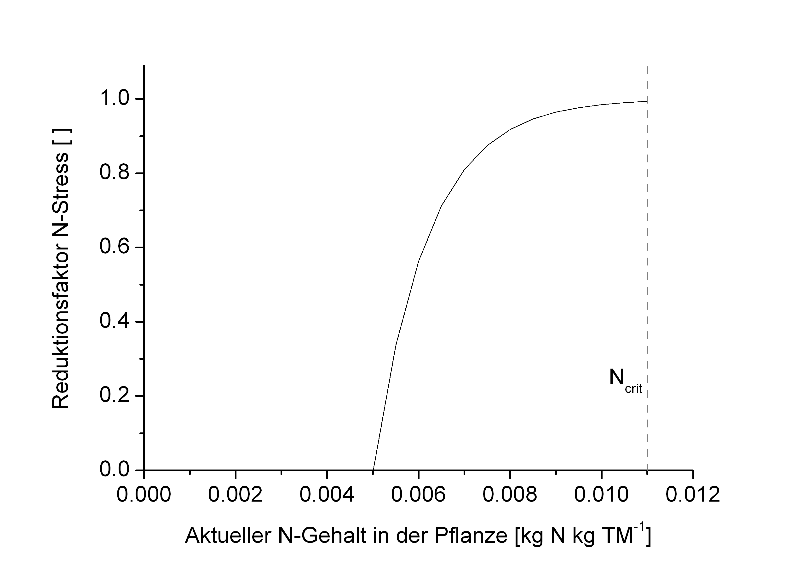

# Stickstoffmangel

Stickstoffmangel wird angezeigt, wenn der N-Gehalt in der Pflanze den kritischen N-Gehalt unterschreitet. Der Reduktions-Faktor ergibt sich aus

$`\small \zeta_N = 1-e^{N_m - \left( 5\cdot \frac{N_{act} - N_m} {N_{crit} - N_m}  \right)} `$

$`\small \zeta_N `$	Reduktionsfaktor N-Stress	  
$`\small N_m`$	Minimale N-Konzentration in der Pflanze	$`\small [kg \, N \, kg \, TM^{-1}] `$ 
$`\small N_{act}`$	Aktuelle N-Konzentration in der Pflanze	$`\small [kg \, N \, kg \, TM^{-1}] `$ 
$`\small N_{crit}`$	Kritische N-Konzentration in der Pflanze	$`\small [kg \, N \, kg \, TM^{-1}] `$ 

 
Abb. 1: Reduktionsfunktion für N-Stress in Abhängigkeit vom aktuellen N-Gehalt der oberirdischen Pflanzenteile. Ncrit = kritischer N-Gehalt.

## Literatur

* Challinor et al. (2005): Simulation of the impact of high temperature stress on annual crop yields. Agricultural and Forest Meteorology 135, 180 - 189.

* Mirschel, W. & Wenkel, K.-O., 2007. Modelling soil-crop interactions with AGROSIM model family. In: K.C. Kersebaum, J.-M. Hecker, W. Mirschel and M. Wegehenkel (Editors), Modelling water and nutrient dynamics in soil crop systems. Springer, Stuttgart, pp. 59- 74.

* Moriondo et al. (2011): Climate change impact assessment: the role of climate extremes in crop yield simulation. Climatic Change 104 (3-4), 679-701.