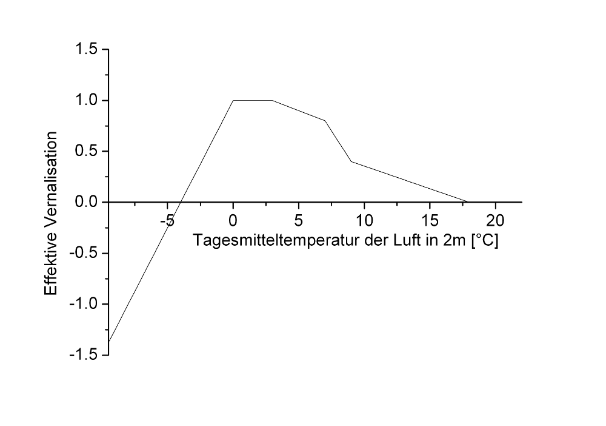

# Ontogenese

Die Simulation der Entwicklung der Pflanze erfolgt nach dem Prinzip der Wärmesummierung. Die dafür wirksame Temperatur wird durch eine Minimaltemperatur, der Basistemperatur, begrenzt. Für das Auflaufen der gesäten Kulturen muss eine für das Keimen günstige Bodenfeuchte vorhanden sein, also mindestens 30% Kapillarwassergehalt, jedoch keine Überstauung von Wasser an der Geländeoberfläche. Wenn das der Fall ist, wird die Temperatur der obersten Bodenschicht zur Summenbildung herangezogen.

$`\small DD_{0, t} = DD_{0,t-1} + (T_{S10} - T_{B0}) \cdot \Delta t `$

$`\small DD_{0, t}`$	Aktuelle Wärmesumme im Entwicklungsstadium 0	$`\small [^{\circ} C \, d] `$ 
$`\small DD_{0, t-1}`$	Wärmesumme im Stadium 0 am Vortag	$`\small [^{\circ} C \, d] `$ 
$`\small T_{S10}`$	Bodentemperatur in 0 – 10 cm Bodentiefe	$`\small [^{\circ} C] `$ 
$`\small T_{B0} `$	Basistemperatur Stadium 0	$`\small [^{\circ} C] `$ 
$`\small \Delta t`$	Zeitschritt	$`\small [d] `$ 
 
Wenn die pflanzenspezifische Temperatursumme für das Auflaufen des Sämlings erreicht ist, beginnt das nächstfolgende Entwicklungsstadium. Ab jetzt wird die Tagesmitteltemperatur aufsummiert. Die Stressfaktoren Trockenheit und N-Mangel beschleunigen die Summenbildung, Faktoren für Vernalisation und Tageslänge verlangsamen sie.

$`\small DD_{n,t} =  DD_{n,t-1} + (T_{av} - T_{Bn}) \cdot b_s \cdot b_v \cdot b_D \cdot \Delta t `$

$`\small DD_{n,t}`$	Aktuelle Wärmesumme im Entwicklungsstadium n	$`\small [^{\circ} C \, d] `$ 
$`\small DD_{n,t-1}`$	Wärmesumme im Stadium n am Vortag	$`\small [^{\circ} C \, d] `$ 
$`\small T_{av}`$	Tagesmitteltemperatur der Luft in 2m Höhe	$`\small [^{\circ} C] `$ 
$`\small T_{Bn}`$	Basistemperatur Stadium n	$`\small [^{\circ} C] `$ 
$`\small b_s`$	Beschleunigungsfaktor Umweltstress 
$`\small b_v`$	Vernalisationsfaktor 
$`\small b_D`$	Tageslängenfaktor 
$`\small \Delta t`$	Zeitschritt	$`\small [d] `$ 
 
mit

$`\small b_s = max( 1 + ( 1 - \zeta_W)^2, 1 + (1-\zeta_N)^2  ) `$

$`\small b_s `$	Beschleunigungsfaktor Umweltstress 
$`\small \zeta_w`$	Stressfaktor Wassermangel 
$`\small \zeta_N`$	Stressfaktor Stickstoffmangel 
 
Effective vernalisation in relation to the daily mean air temperature.

 
Abbildung 1:  Die effektive Vernalisation in Abhängigkeit von der Tagesmitteltemperatur der Luft..

Die Erfüllung des Vernalisationsanspruchs der Pflanze wird wie folgt berücksichtigt: :

$`\small b_V = \begin{cases}  \frac{(d_V - d_{VT})}{(d_{VR} - d_{VT})} & d_{VT} \geq 1 \\ 1 & d_{VT}<1  \end{cases}`$

$`\small b_V`$	Vernalisationsfaktor 
$`\small d_V`$	Aktuelle Anzahl Vernalisationstage	$`\small [d] `$ 
$`\small d_{VT}`$	Schwellwert Vernalisation	$`\small [^{\circ} C \, d] `$ 
$`\small d_{VR}`$	Pflanzenspezifisches Vernalisationsbedürfnis	$`\small [^{\circ} C \, d] `$ 
 
where

$`\small d_V = d_{V-1} + b_{V_{eff}} \cdot \Delta t`$

$`\small d_V`$	Aktuelle Anzahl Vernalisationstage	$`\small [d] `$ 
$`\small d_{V-1}`$	Anzahl Vernalisationstage bis Vortag	$`\small [d] `$ 
$`\small b_{V_{eff}}`$	effektive Vernalisation 
$`\small \Delta t`$	Zeitschritt	$`\small [d] `$ 
 
und

$`\small d_{VT} = min( d_{VR}, 9 ) - 1`$

$`\small d_{VT} `$	Schwellwert Vernalisation	$`\small [^{\circ} C \, d] `$ 
$`\small d_{VR}`$	Pflanzenspezifisches Vernalisationsbedürfnis	$`\small [^{\circ} C \, d] `$ 
 
Der Vernalisationsfaktor ist stets positiv.

Die Tageslänge wird in Bezug auf eine pflanzenspezifische Basis-Tagesläge und auf das Tageslängenbedürfnis der Pflanze berücksichtigt

$`\small b_D = \frac{N_{photo} - N_{basis}}{N_{req} - N_{basis}}`$

$`\small b_D`$	Tageslängenfaktor 
$`\small N_{photo}`$	Photoperiodische Tageslänge	$`\small [h] `$ 
$`\small N_{basis}`$	pflanzenspezifische Basis-Tagesläge	$`\small [h] `$ 
$`\small N_{req}`$	pflanzenspezifisches Tageslängenbedürfnis	$`\small [h] `$ 
 