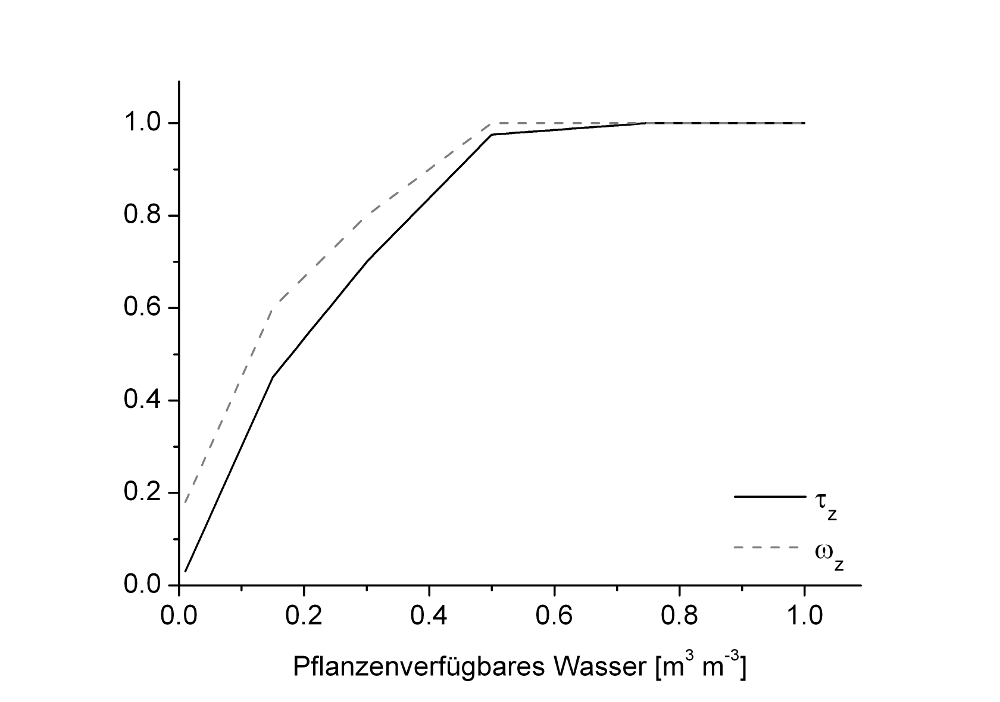

# Transpiration

Die Transpiration der Pflanze wird aus der Referenz-Evapotranspiration berechnet. Die Referenz-Evapotranspiration für eine kurz geschnittene Grasfläche ET0 wird mit Hilfe der Penman-Monteith-Methode berechnet (1998).

$`\small ET_0 = \frac{0.408 \cdot \Delta \cdot (R_n - G) + \gamma \cdot \frac{900}{\gamma + 273} \cdot u_2 \cdot (e_s - e_a) } {\Delta + \gamma \cdot (1+\frac{r_a}{r_s})} `$

$`\small  \Delta`$	Gradient der Dampfdruckkurve	$`\small  [kPa\,K^{-1}]`$ 
$`\small  R_n`$	Nettostrahlung an der Bestandesoberfläche	$`\small  [MJ\, m^{-2} \, d^{-1}]`$ 
$`\small  G`$	Bodenwärmeflussdichte	$`\small  [MJ\, m^{-2} \, d^{-1}]`$ 
$`\small  T`$	Tagesmitteltemperatur der Luft in 2 m Höhe	$`\small  [^{\circ} C]`$ 
$`\small  u_2`$	Windgeschwindigkeit in 2 m Höhe	$`\small  [m \, s^{-1}]`$ 
$`\small  e_s`$	Sättigungsdampfdruck	$`\small  [kPa]`$ 
$`\small  e_a`$	aktueller Dampfdruck	$`\small  [kPa]`$ 
$`\small  \gamma`$	Psychrometerkonstante	$`\small  [kPa \, K^{-1}]`$ 
$`\small  r_a`$	Atmosphärischer Widerstand	$`\small  [s\, m^{-1}]`$ 
$`\small  r_s`$	Oberflächenwiderstand	$`\small  [s\, m^{-1}]`$ 
 
mit

$`\small \gamma = 6.65 \cdot 10^{-4} \cdot P `$

Der Oberflächenwiderstand berechnet sich unter der Annnahme eines 12cm hohen Grasbestandes als:

$`\small r_s = \frac {r_1} {1.44} `$

$`\small r_1`$	Stomata -Widerstand; 100 s m–1	$`\small [s \, m^{-1}] `$

Für die Transpiration des tatsächlichen Pflanzenbestandes werden die Bestandeshöhe und der Blattflächenindex berücksichtigt.

$`\small r_s = \frac{r_1}{LAI \cdot h_c} `$

$`\small r_s `$	Surface resistance	$`\small [s \, m^{-1}] `$ 
$`\small r_1 `$	Stomata-Widerstand	$`\small [s \, m^{-1}] `$ 
$`\small LAI `$	Blattflächenindex	$`\small [m^2 \, m^{-2}] `$ 
$`\small h_c`$	Bestandeshöhe	$`\small [m] `$ 

Der Stomata-Widerstand wird entsprechend nach dem Vorschlag von Yu et al. (2001) berechnet:

$`\small r_1  = \frac{C_s \cdot (1+\frac{e_a}{e_s}) } {a \cdot A_g} `$

$`\small r_1`$	Stomata-Widerstand	$`\small [s^{-1}] `$ 
$`\small C_s`$	CO2-Konzentration der Blattumgebung (= Ca)	$`\small [\mu mol \, mol^{-1}] `$ 
$`\small A_g`$	Brutto-CO2-Assimilationsrate	$`\small [kg \, CO_2 \, ha^{-1} \, d^{-1}] `$ 
$`\small e_a`$	Aktueller Dampfdruck der Luft	$`\small [Pa] `$ 
$`\small e_s`$	Sättigungsdampfdruck der Luft	$`\small [Pa] `$ 
 
Cs wird in diesem Fall gleich der atmosphärischen CO2-Konzentration Ca gesetzt. Die saisonale Dynamik der atmosphärischen CO2-Konzentration von 1958 bis heute wird mit folgender Funktion beschrieben
 
$`\small C_a = 222 + e^{ 0.0119 \cdot (t_{dec} - 1580) } + 2.5 \cdot \left(   \frac{t_{dec} - 0.5} {0.1592} \right) `$

$`\small C_a `$	Atmospherische CO2 Konzentration	$`\small [\mu mol \, mol^{-1}] `$ 
$`\small t_{dec}`$	Dezimaldatum 

mit dem Datum in Dezimalform tdec. Diese Funktion schreibt außerdem die atmosphärischen CO2-Konzentration unter der Annahme des A1B-Szenarios des IPCC (IPCC 2007) bis ins Jahr 2100 fort.

Die fruchtartspezifische potentielle Evapotranspiration wird berechnet mit Hilfe von ebenso fruchtartspezifischen Faktoren (Kc) während der Wachstumsperiode und Faktoren für den unbedeckten Boden in der Zeit zwischen Ernte und Auflaufen der neuen Frucht. Die Kc-Faktoren sind an die Entwicklungsstadien der Fruchtart gekoppelt.

$`\small ET_p = ET_0 \cdot K_c - I `$

$`\small ET_p`$	Potenzielle Evapotranspiration	$`\small [mm] `$ 
$`\small ET_0`$	Referenz-Evapotranspiration	$`\small [mm] `$ 
$`\small K_c`$	Fruchtartenspezifischer Faktor 
$`\small I`$	Evaporation aus dem Interzeptionsspeicher	$`\small [mm] `$ 

Die Anteile von Evapora­tion und Transpiration an der Gesamtverdunstung werden vom Bedeckungsrad abgeleitet.

$`\small T_p = ET_p \cdot \beta `$

$`\small T_p `$	Potenzielle Transpiration	$`\small [mm] `$ 
$`\small ET_p`$	Potenzielle Evapotranspiration	$`\small [mm] `$ 
$`\small \beta`$	Bedeckungsgrad 
 
Für die Wasserentnahme aus der jeweiligen Bodenschicht wird die Transpiration schichtweise unter Berücksichtigung der Wurzelverteilung und -effektivität und möglichem Sauerstoffmangel berechnet.

$`\small T_z = T_p \cdot \frac {\omega_z \cdot \Lambda_z}   {\sum^{z_{max}}_{i=1} \omega_i \cdot \Lambda_j} \cdot \zeta_o`$

$`\small T_z`$	Aktuelle Transpiration in Tiefe z	$`\small [mm] `$ 
$`\small T_p`$	Potenzielle Transpiration	$`\small [mm] `$ 
$`\small \omega_z`$	Wurzeleffektivität in Tiefe z (Abb. 1) 
$`\small \Lambda_z`$	Wurzellängendichte in Tiefe z	$`\small [m \, m^{-3}] `$ 
$`\small \zeta_o`$	Stressfaktor Sauerstoffmangel 

 
Abbildung 1: Reduktionsfunktion für die Transpiration ($`\tau_z`$) und für die Effektivität der Wasseraufnahme der Wurzel ($`\omega_z`$) in Abhängigkeit von der Wasserverfügbarkeit in der jeweiligen Bodenschicht.

Dabei wird, ausgehend von der Bodenoberfläche, von oben nach unten Wasser entsprechend der berechneten schichtweisen Transpiration aus den Bodenschichten entnommen. Vorausgesetzt ist, dass dort ausreichend Wasser vorhanden ist. Für jede Schicht wird zu diesem ein potenzielles Transpirationsdefizit berechnet.

$`\small \zeta_{Wpot} = \left(  \frac{T_z}{d\cdot 1000} - (\theta - \theta_{PWP} ) \right) \cdot \Delta z \cdot 1000 `$

$`\small \zeta_{Wpot}`$	Potenzielles Transpirationsdefizit in Tiefe z	$`\small [mm] `$ 
$`\small T_z`$	Aktuelle Transpiration in Tiefe z	$`\small [mm] `$ 
$`\small \Delta z`$	Mächtigkeit der Bodenschicht	$`\small [m] `$ 
$`\small \theta `$	Wassergehalt der Bodenschicht	$`\small [m^3\, m^{-3}] `$ 
$`\small \theta_{PWP}`$	Wassergehalt am permanenten Welkepunkt	$`\small [m^3\, m^{-3}] `$ 
 
Parallel dazu wird eine aufgrund von mit abnehmenden Wassergehalten abnehmender Wasserleitfähigkeit im Boden reduzierte Transpiration in der Bodenschicht berechnet

$`\small T_{red} = T_z \cdot (1-\tau_z)`$

$`\small T_{red} `$	Reduzierte Transpiration in Tiefe z	$`\small [mm] `$ 
$`\small T_z`$	Aktuelle Transpiration in Tiefe z	$`\small [mm] `$ 
$`\small \tau_z`$	Reduktionsfaktor Wasserverfügbarkeit (Abb. 1) 
 

Das tatsächliche Transpirationsdefizit der jeweiligen Schicht wird aus dem größeren der beiden Werte ermittelt und für die erneute Berechnung der aktuellen Transpiration verwendet.

$`\small \zeta_{Wact} = max(\zeta_{Wpot}, T_{red})`$

$`\small \zeta_{Wact} `$	Aktuelles Transpirationsdefizit in Tiefe z	$`\small [mm] `$ 
$`\small \zeta_{Wpot}`$	Potenzielles Transpirationsdefizit in Tiefe z	$`\small [mm] `$ 
$`\small T_{red} `$	Reduzierte Transpiration in Tiefe z	$`\small [mm] `$ 
 
Die gesamte tatsächliche Transpiration der Pflanze ergibt sich aus der Summe der Schichtwerte

$`\small T_a = \sum^{z_{max}}_{z=1} T_z`$

$`\small T_a `$	Aktuelle Transpiration	$`\small [mm] `$ 
$`\small T_z`$	Aktuelle Transpiration in Tiefe z	$`\small [mm] `$ 
$`\small z `$	Bodenschicht 
$`\small z_{max}`$	Maximale Bodentiefe 
 
Das Pflanzenwachstum wird durch Wassermangel limitiert. Trockenstress ist durch das Verhältnis zwischen aktueller und potentieller Transpiration indiziert (Kersebaum, 1995).