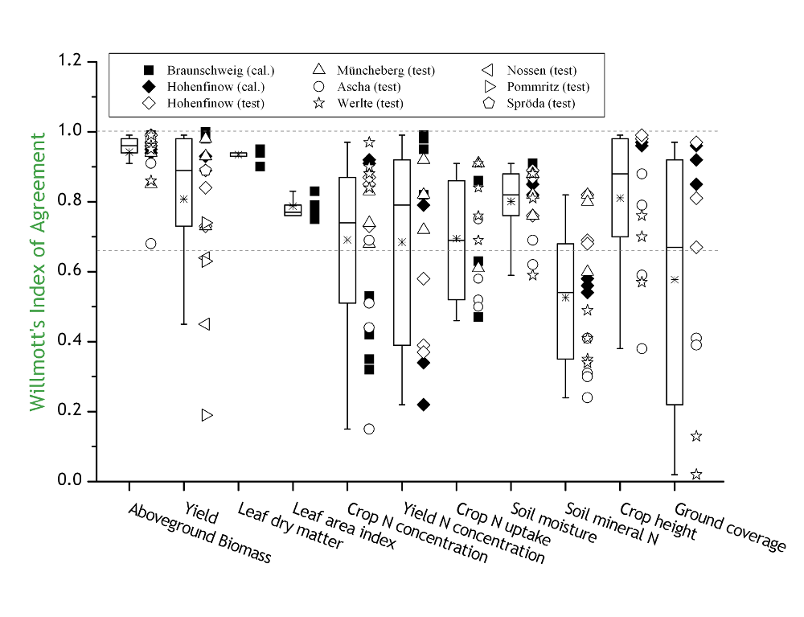
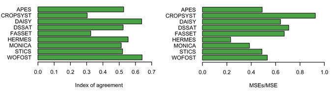

# THE MODEL FOR NITROGEN AND CARBON IN AGRO-ECOSYSTEMS

## Table of contents

[Überblick](#Überblick)

[Geschichte des Modelles](#Geschichte)

[Bodenprozesse](soil_processes/overview_de.md)

[Pflanzenprozesse](crop_processes/overview_de.md)

[Validierung](#Validierung)

[Anwendungen](#Anwendungen)

[Publications](publications.md)

[Download](https://github.com/zalf-rpm/monica/releases)

[GitHub](https://github.com/zalf-rpm/monica)

[Wiki](https://github.com/zalf-rpm/monica/wiki)

[Contact](#Contact)

# Überblick

MONICA ist ein dynamisches, prozess-orientiertes Simulationsmodell, das den Transport und die biochemische Umsetzung von Kohlenstoff, Stickstoff und Wasser in Agrarökosystemen beschreibt. Zu diesem Zweck werden im Tagesschritt die wichtigsten Prozesse im Boden und in der Pflanze mechanistisch abgebildet und auf eine Weise miteinander verknüpft, dass Rückkopplungen der einzelnen Prozesse möglichst naturnah wiedergegeben werden. MONICA arbeitet eindimensional und umfasst einen räumlichen Ausschnitt von etwa 1 m² Fläche bei einer Profiltiefe von 2 m.

Das Akronym MONICA ergibt sich aus der Bezeichnung „MOdell für die Stickstoff- (engl. NItrogen) und Kohlenstoff- (engl. Carbon) -dynamik in Agrarökosystemen“

## Was kann MONICA?
MONICA berechnet zu jedem Tagesschritt alle wichtigen Prozesse, die einen Einfluss auf den biochemischen Umsatz von Kohlenstoff und Stickstoff im Boden und deren Transport im Boden, in der Luft und in der Pflanze haben. Dabei können viele für den Nutzer interessante Größen jeden Tag simultan abgefragt werden. Das wären z.B. einfach messbare Größen wie die Bodenfeuchte, der Stickstoff- und Kohlenstoffgehalt im Boden, die pflanzliche Biomasse oder der Ernteertrag. Diese Größen eignen sich gut, um die Simulationen von MONICA zu auf deren Verlässlichkeit zu überprüfen. MONICA gibt aber auch Größen aus, die nur mit großem messtechnischen Aufwand zu erfassen wären, wie z.B. die Stickstoffmineralisation aus Ernterückständen oder Wirtschaftsdüngern, die NH3-, N2O- und CO2-Emission aus dem Boden, die Denitrifikation, die potentielle Grundwasserneubildungsrate, die Bestandesverdunstung oder die Auswaschung von Nitrat in tiefere, wurzelferne Bodenschichten.

## Welche Prozesse beschreibt MONICA?

MONICA beschreibt Prozesse in Boden und Pflanze sowie Austauschprozesse mit der angrenzenden Hydro- und Atmosphäre. Auf der Basis der eingehenden Wetterdaten berechnet MONICA zunächst die Bodentemperatur für die einzelnen diskreten Schichten des Bodens. Die Bewegung des Wassers im Boden wird nach dem Kapazitätsansatz beschrieben. Dabei wird Wasser, das nicht in der Bodenschicht gespeichert werden kann, in die nächste, darunter befindliche Bodenschicht weitergegeben. Die Speicherkapazität und die Flussrate werden durch die Textur und den Humusgehalt des Bodens bestimmt. Evaporation und die Aufnahme von Wasser durch die Pflanzenwurzel beeinflussen den Wasserhaushalt. In Grundwassernähe kann Wasser kapillar in den Wurzelsaum aufsteigen.

Fließendes Wasser transportiert Nitrat. Es entsteht durch den Umsatz organischer Substanz in Ammonium (Ammonifikation) und den weiteren Umsatz von Ammonium in Nitrat (Nitrifikation). Unter Sauerstoffarmut kann auch eine Reaktion von Nitrat zu Luftstickstoff erfolgen (Denitrifikation), bei der das klimawirksame Gas N2O entsteht. Die dabei beteiligten Mikroorganismen und deren Stoffwechsel, bei dem CO2 freigesetzt wird, werden ebenso simuliert. Bei der Ausbringung von Wirtschaftsdüngern gast NH3 aus. Aber auch Harnstoff, ausgebracht als Pflanzendünger, hydrolysiert im Boden und setzt NH3 frei.

Für die Pflanze, deren Masse täglich entsprechend dem Strahlungsangebot und der Temperatur zunimmt, werden ein anzustrebender und ein kritischer Stickstoffgehalt berechnet. Der erste Wert ist die Grundlage der Berechnung der Stickstoffaufnahme der Pflanze aus dem Boden, der zweite Wert zeigt an, wann der Pflanze zu wenig Stickstoff zum Wachsen zur Verfügung steht. In diesem Fall, wie auch bei Wassermangel, wird der tägliche Zuwachs der Pflanze reduziert. Im Tagesschritt wächst auch die Wurzel in die Tiefe. Die berechnete Wurzelmasse wird dabei entsprechend auf die Bodenschichten verteilt. Daran orientiert sich die Menge des aufgenommenen Wassers und Stickstoffs durch die Pflanze aus der jeweiligen Schicht.

Wird die Pflanze geerntet, verbleiben Ernterückstände im Boden, die wiederum abgebaut werden und zum Humuserhalt und zur Stickstoffmineralisation im Boden beitragen. Jedes organische Material hat dabei bestimmte Eigenschaften, die beim Abbau berücksichtigt werden. So wird ein Salatblatt viel schneller mineralisiert als Weizenstroh. MONICA kann derzeit acht verschiedene Pflanzen simulieren.

## Wie lässt MONICA die Pflanze wachsen?

Das Konzept des Pflanzenwachstums in MONICA beruht auf der Berechnung der Kohlenhydratbildung in Abhängigkeit vom Strahlungsangebot. Der Prozess der Photosynthese wird dadurch vereinfacht dargestellt. Die Effizienz der Kohlenhydratbildung ist temperaturabhängig. Die Entwicklung der virtuellen Pflanze vom Aussaatzeitpunkt bis zur Erntereife wird anhand der auflaufenden Temperatursumme bestimmt. Für jedes Entwicklungsstadium wird die Verteilung der gebildeten Kohlenhydrate angepasst. So wird zunächst das Wachstum der Wurzel und Blätter, später das der Sprossachse und der Frucht gefördert. Die verteilten Kohlehydrate werden in Trockenmasse umgerechnet und, im Falle der Blätter, auch in Blattfläche. Die Blattfläche wiederum, als primärer Ort für die Photosynthese, geht in die Berechnung der Kohlehydratbildung ein.

Die Trockenmasse, die der Wurzel zugeteilt wird, wird nach einer empirischen Formel auf die Bodenschichten verteilt. Die aktuelle Durchwurzelungstiefe hängt zum einen von der Bodentextur, zum anderen von der Pflanze selbst ab. Die Wurzellängendichte begrenzt wiederum die Aufnahmefähigkeit der Wurzel für Wasser und Stickstoff.

Aus der Blattfläche wird der Bedeckungsgrad berechnet, der wiederum den Anteil der Transpiration an der gesamten Verdunstung aus Pflanze und Boden (Evapotranspiration) bestimmt. Die aktuelle Evapotranspiration wird mit Hilfe von pflanzenspezifischen Koeffizienten relativ zu der einer kurzgeschnittenen Grasfläche berechnet. Der Wasserverlust wird, wenn das Dargebot ausreichend ist, entsprechend der Wurzelverteilung aus den Bodenschichten entnommen. Reicht das Dargebot nicht, und unterschreitet einen spezifischen Grenzwert, wird das Wachstum der Pflanze reduziert. Das ist auch der Fall, wenn das Stickstoffdargebot im Boden nicht ausreicht, um den kritischen Stickstoffgehalt der Pflanze nicht zu unterschreiten.
Zur Ernte wird das Erntegut entfernt, die verbleibenden Pflanzenteile werden dem Boden zugeführt. Der Stickstoff in der Pflanze wird zwischen Erntegut und Residuen aufgeteilt.

# Geschichte

## Entwicklung von MONICA

MONICA ist eine Weiterentwicklung des HERMES Modells. Das Modell HERMES ist ein reines Stickstoffmodell. Um Aussagen bezüglich der Kohlenstoffdynamik unter den Bedingungen eines sich wandelnden Klimas treffen zu können, musste HERMES modifiziert werden. Der simple Algorithmus für die Berechnung der Stickstoffmineralisation aus organischer Substanz musste einem umfangreicheren Ansatz weichen, der dem dänischen DAISY-Modell entlehnt wurde. Es berechnet den Kohlenstoffumsatz und leitet daraus Aussagen über den Stickstoffgehalt ab. Mit diesem Ansatz lässt sich auch die Dynamik der mikrobiellen Biomasse im Boden abbilden.

Als weitere Änderung wurde ein Algorithmus eingeführt, der den Einfluss des atmosphärischen CO2-Gehaltes auf die Photosynthese und die Transpiration der Pflanze erklärt. Auf diese Weise ist es möglich, die erhöhte Photosyntheseleistung und die verbesserte Wassernutzungseffizienz von Pflanzen unter erhöhten CO2-Konzentrationen zu simulieren, wie sie in Freiland-Anreicherungsversuchen beobachtet wurden.

Zuletzt wurde das neue Modell, das den Namen MONICA erhielt, mit automatischer Düngung und Bewässerung ausgerüstet. Somit ist es möglich, MONICA im Szenarienbetrieb über lange Zeiträume laufen zu lassen, ohne das Management der virtuellen Pflanze ständig anpassen zu müssen.

## Der Vorgänger - HERMES

Das Modell HERMES (Kersebaum 1989) war das erste in Deutschland entwickelte Simulationsmodell für die ganzjährige Abbildung der N-Dynamik von Ackerstandorten. Es arbeitet mit einem generischen, Photosynthese-getriebenen Pflanzenmodell nach dem Vorbild von SUCROS (Van Keulen et al. 1982) und ist deshalb in der Lage, eine Vielzahl von Kulturpflanzen zu berücksichtigen. Das Prozessmodell beruht insgesamt auf einfachen Algorithmen und benötigt nur wenige Input-Variablen. Da es jedoch die deutsche Klassifikationssystematik für Textur, Lagerungsdichte und Humusgehalt und die nur in Deutschland verwendete Verdunstungsformel nach Haude verwendet, hat es sich nicht international durchsetzen können. Innerhalb Deutschlands wurde es jedoch bereits vielfach angewendet, auch auf größerer Skala in Verbindung mit einem Geo-Informationssystem. Neuere Erweiterungen um zusätzliche Verdunstungsansätze (Turc-Wendling, Penman-Monteith) sowie die Möglichkeit einer freieren Parametrisierung von Böden erlauben auch den Einsatz außerhalb Europas (Kersebaum et al. 2008). Das HERMES-Modell bildet das Kernstück für MONICA.

### Literatur

* Kersebaum, K.C. (1989): Die Simulation der Stickstoff-Dynamik von Ackerböden. Dissertation Universität Hannover.

* Van Keulen, H., Penning de Vries, F.W.T., Drees, E.M. (1982): A summary model for crop growth. In: Penning de Vries, F.W.T. & Van Laar, H.H. (Hrsg.): Simulation of plant growth and crop production. PUDOC, Wageningen, 87 - 97.

* Kersebaum, K.C., Wurbs, A., De Jong, R., Campbell, C.A., Yang, J., Zentner, R.P. (2008): Long term simulation of soil-crop interactions in semiarid southwestern Saskatchewan, Canada. European Journal of Agronomy 29, 1-12.

## Technische Details

MONICA ist in der Programmiersprache C++ geschrieben. Die erleichtert die Anbindung an andere Programme, die mit MONICA zusammenarbeiten und ist sehr schnell. Somit können auch lange Zeiträume mit MONICA in wenigen Sekunden berechnet werden.

Der Aufbau von MONICA ist modular. In einem zentralen Steuermodul werden Ablaufe des Pflanzenmanagements (Saat, Düngung, Bewässerung, Bodenbearbeitung, Ernte) sortiert und zugeordnet und die entsprechenden Fachmodule angesteuert. Es übernimmt außerdem die Bereitstellung und Ausgabe der Ergebnisse. Die Fachmodule berechnen die Bodentemperatur, den Bodenwasserhaushalt, den Bodenstofftransport, den Umsatz organischer Substanz im Boden und das Pflanzenwachstum. Ein weiteres zentrales Modul speichert relevante Zustandsvariablen in den jeweiligen Bodenschichten.

# Validierung

MONICA wurde nach der Fertigstellung an Datensätzen aus verschiedenen Feldexperimenten kalibriert und getestet. Dabei wurde auf eine Nachkalibrierung zur Anpassung an andere Standorte verzichtet. Außerdem nach MONICA bereits an einem internationalen Modellvergleich zur Simulation von Sommergerste teil.

Abbildung 1: Die Simulation verschiedener Feldexperimente mit MONICA. Ein Index of Agreement von 1 bezeichnet eine perfekte Übereinstimmung von Modellergebnis und Messwert. Ein geringer Anteil an systematischer Abweichung gilt als wünschenswert.

 
Abbildung 2: Ein Vergleich der Leistung verschiedener Modelle bei der Simulation von Sommergerste an Standorten in Europa.

# Anwendungen

MONICA ist bis heute in drei größeren Verbundprojekten verwendet worden:

* Das Projekt LandCaRe 2020 beschäftigte sich mit der Entwicklung einer Wissensplattform, auf der sich betroffene Interessentengruppen über die zu erwartenden Auswirkungen des Klimawandels auf die Landwirtschaft in Deutschland informieren können (BMBF Förderschwerpunkt KlimaZwei).
* Im Projekt CarBioCial werden derzeit drei Regionen entlang eines Landnutzungsgradienten in Süd-Amazonien (Brasilien) analysiert, um später Empfehlungen für eine möglichst kohlenstoffneutrale Landbewirtschaftung unter den Bedingungen des Klimawandels in Brasilien geben zu können (BMBF Förderschwerpunkt Nachhaltiges Landmanagement).
* Im EVA2-Projekt (Entwicklung und Vergleich von optimierten Anbausystem für Energiepflanzen) werden an verschiedenen Standorten in Deutschland Fruchtfolgeversuche durchgeführt. MONICA wird dabei für die Bewertung der abiotischen Folgewirkungen des Energiepflanzenanbaus speziell für die Quantifizierung der Grundwasserneubildung und des Stickstoffaustrags eingesetzt.

# Contact

 

[Leibniz-Zentrum für Agrarlandschafts-forschung (ZALF) e.V. 
Eberswalder Str. 84 
15374 Müncheberg ](http://www.zalf.de/de/Seiten/ZALF.aspx)

[Research Platform "Models & Simulation @ ZALF](http://www.zalf.de/de/struktur/fpm/Seiten/default.aspx)

[Dr. Claas Nendel](http://www.zalf.de/de/ueber_uns/mitarbeiter/Seiten/nendel_c.aspx)
