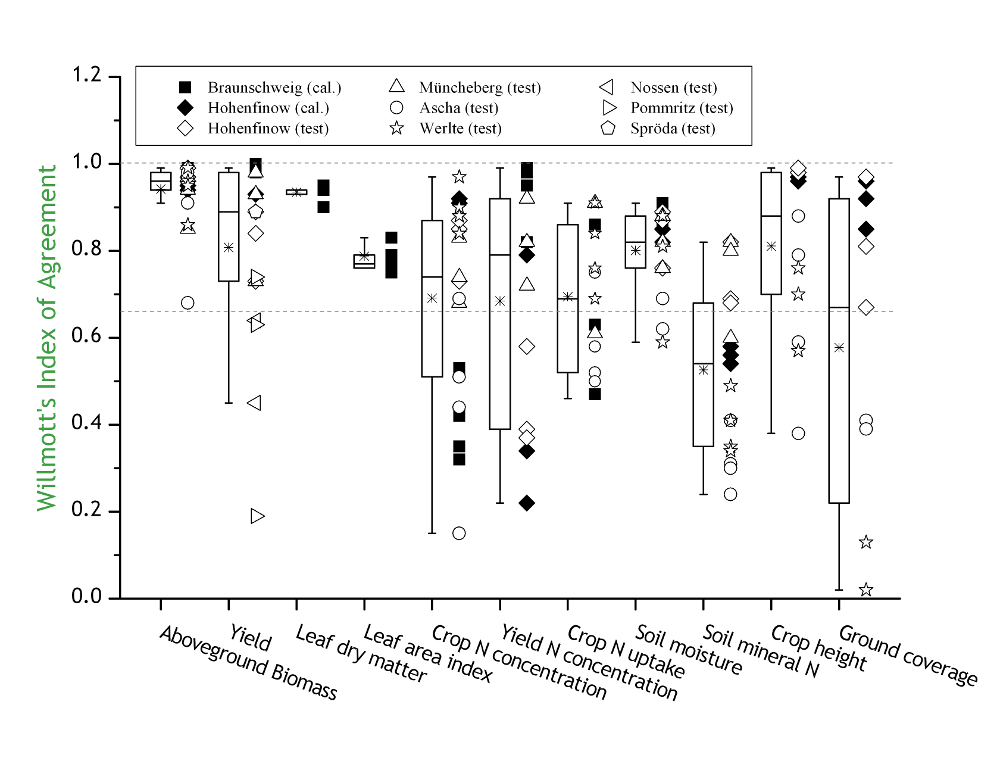
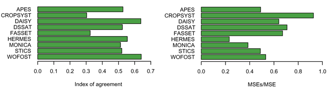

# THE MODEL FOR NITROGEN AND CARBON IN AGRO-ECOSYSTEMS

## Table of contents

[Overview](#overview)

[History](#history)

[Soil processes](soil_processes/overview_en.md)

[Crop processes](crop_processes/overview_en.md)

[Validation](#validiation)

[Applications](#Applications)

[Publications](publications.md)

[Download](https://github.com/zalf-rpm/monica/releases)

[GitHub](https://github.com/zalf-rpm/monica)

[Wiki](https://github.com/zalf-rpm/monica/wiki)

[Contact](#Contact)

# Overview

MONICA is a dynamic, process-based simulation model which describes transport and bio-chemical turn-over of carbon, nitrogen and water in agro-ecosystems. On daily time steps the most important processes in soil and plant are modelled mechanistically. They are linked in such way that feed-back relations of the single processes are reproduced as close to nature as possible. MONICA works one dimensional and represents a space of 1 m² surface area and 2 m depth.

The acronym MONICA is derived from „MOdel of Nitrogen and Carbon dynamics in Agro-ecosystems”.

## What can MONICA do?

For daily time steps, MONICA calculates all processes that interact with the bio-chemical turn-over of carbon and nitrogen in soil and with their transport in soil, air and plant. A broad range of variables being of interest for the user can be accessed day-by-day. This could be easily measureable items, such as soil moisture, carbon and nitrogen contents, the crop’s biomass or yield. These quantities are well suited to evaluate the performance of the MONICA  simulations. However, MONICA also shows items that can only be quantified with great effort, such as nitrogen mineralisation from crop residues or organic fertilisers, NH3-, N2O- and CO2 emission from soil, denitrification, potential groundwater recharge, crop evapotranspiration or the leaching of nitrates into deeper soil layers.

## Which processes are described?

MONICA describes processes in the soil–plant system and the energy and matter exchange with the hydro- and atmosphere. Using daily weather data, it calculates the soil temperature for single discrete layers in the soil. The movement of water in the soil is modelled using a capacity approach. This approach assumes that water that cannot be stored in a soil layer will be passed on to the adjacent layer below. The layer’s storage capacity and its percolation rate are governed by its texture and soil organic matter content. Evaporation and water uptake by the root influence the water budget. If groundwater is accessible capillary water can rise into the root zone.

Moving soil water carries nitrates. They originate from organic matter turn-over, appearing first as ammonium (ammonification) which is later turned into nitrates (nitrification). If oxygen is deficient, nitrate can be transformed into atmospheric nitrogen (denitrification), a process during which the greenhouse gas N2O is produced. The microorganisms facilitating these processes and producing CO2 from their metabolism are also simulated. When organic fertilisers are applied, gaseous NH3 is set free. Furthermore, also urea fertiliser hydrolyses in the soil and releases NH3.

The crop‘s biomass increases according to the daily radiation and temperature. A target and a critical nitrogen concentration are calculated for the plant tissue. The first serves the calculation of nitrogen uptake from the soil, while the second is used to determine nitrogen deficiency. In the latter case, similar to drought stress, the crop’s daily growth increment will be reduced. In daily time steps  the root grows into depth. The calculated root biomass is distributed to the discrete soil layers accordingly. The calculation of water and nitrogen uptake by the plant considers this distribution and consumes from the respective soil layers. 

At harvest, crop residues remain. They are decomposed and contribute to soil organic matter pools, nitrogen mineralisation and CO2 release. Every organic material has its own properties which determine its decay. That way a lettuce leaf will be mineralised much faster than wheat straw. Currently, MONICA is able to simulate eight different crops.

## MONICA’s crop growth concept

The crop growth concept of MONICA is based on the calculation of assimilate production from radiation. In this manner, the process of photosynthesis is simplified. The efficiency of carbohydrate production is dependent on temperature. The virtual crop’s development from seed to harvest maturity is determined using the accumulating temperature. For each developmental stage the distribution of carbohydrates within the crop is continuously adjusted.  In early stages root and leaf growth is promoted, while shoot and fruit growth will be increasingly supported at later stages. The distributed carbohydrates will be converted into dry matter biomass and – in the case of leaves – also in leaf area. In turn, leaf area as the main location for photosynthesis finds its way into the calculation of carbohydrate production.

The amount of dry matter assigned to the root is distributed down the soil profile according to an empirical formula. The current rooting depth is depending on soil texture, but also on the crop itself. Further on, root length density limits the root’s ability to take up water and nitrogen.  

From leaf area, the degree of soil coverage is estimated, which in turn determines the fraction of transpiration from total evapotranspiration. Actual evapotranspiration is calculated relative to a cut grass crop, using crop-specific coefficients. The resulting water loss is then – a sufficient supply assumed – taken from the respective soil layers according to the root distribution. In case water supply is insufficient and falls below a specific threshold value crop growth will be reduced. This also applies in the case of nitrogen supply from soil being insufficient for maintaining the N concentration in the crop tissue above a critical level.

At harvest marketable parts of the crop are removed and the remaining residues are allocated to conceptual organic matter pools in the soil. Nitrogen in the crop is then divided between marketable yield and crop residues.

# History

## The development of MONICA

MONICA is a successor of the the HERMES model. HERMES is a pure nitrogen model. It had to be modified to also support research questions on carbon dynamics under climate change. The simple algorithm for the calculation of nitrogen mineralisation from soil organic matter was replaced by a more comprehensive one, which was taken from the Danish DAISY model. It calculates the carbon turn-over and derives nitrogen dynamics from it. This approach also considers soil microbial biomass dynamics. Furthermore, the impact of atmospheric CO2 concentration on the crop’s photosynthesis and transpiration was introduced.

Using these algorithms, the increased photosynthesis and the improved water used efficiency of crops grown under elevated CO2 concentrations can be simulated according to observations made from free air carbon enrichment experiments. Finally the new model, which was given the name MONICA, was equipped with automatically triggered fertilising and irrigation routines. They enable MONICA to run in long-term scenarios without having to adjust the virtual crop’s management to gradually changing conditions.

## MONICA’s predecessor: the HERMES model

The HERMES model (Kersebaum 1989) was the first simulation model for the year-round simulation of N dynamics in agricultural sites developed in Germany. It uses a generic, photosynthesis-driven crop model, built on the archetype SUCROS (Van Keulen et al. 1982). This enables HERMES to consider a broad range of crops. In general, the process model comprises rather simple algorithms and requires easy-to-access input data only.

However, HERMES used some input information that was specific for Germany, such as the German soil classification system and Haude’s evapotranspiration factors. For this reason it was not much used by international colleagues. In Germany, however, HERMES was applied in many case studies, including regional applications in combination with a geo-information system. More recent releases include alternative evapotranspiration algorithms and enable a less restrictive parameterisation of the soil. This version was also applied outside Europe (Kersebaum et al. 2008). The HERMES model is considered the heart of MONICA.

### References

* Kersebaum, K.C. (1989): Die Simulation der Stickstoff-Dynamik von Ackerböden. Dissertation Universität Hannover.

* Van Keulen, H., Penning de Vries, F.W.T., Drees, E.M. (1982): A summary model for crop growth. In: Penning de Vries, F.W.T. & Van Laar, H.H. (Hrsg.): Simulation of plant growth and crop production. PUDOC, Wageningen, 87 - 97.

* Kersebaum, K.C., Wurbs, A., De Jong, R., Campbell, C.A., Yang, J., Zentner, R.P. (2008): Long term simulation of soil-crop interactions in semiarid southwestern Saskatchewan, Canada. European Journal of Agronomy 29, 1-12

## Technical details

MONICA was programmed using the C++ language. This alleviates the connection to other programs that work together with MONICA, and it is very fast. Now simulations covering a long period of time can be run in seconds.

MONICA’s construction is modular. In a central control module crop management actions (sowing, fertilising, irrigation, tillage, and harvest) are sorted and assigned to the respective topical modules. It is in charge for the provision and output of results. The topical modules calculate soil temperature, soil water dynamics, soil matter transport, soil organic matter turn-over and crop growth. An additional central module saves relevant state variables in the respective soil layers.

# Validation

After being programmed, MONICA was calibrated and tested against data sets from various field experiments. In this process, any recalibration for different sites was avoided.  MONICA took part in a international contest on modelling spring barley.

 
Figure 1: The simulation of various field experiments using MONICA. An Index of Agreement of 1 marks a perfect match between simulated and measured values. A small percentage of systematic deviation is desired.

  
Figure 2: A performance comparison between different models simulating spring barley in Europa.

# Applications
MONICA has been applied so far within three major research projects:

* The LandCaRe 2020 project focussed on the development of a knowledge platform on which stakeholders can access information on the expected impact of climate change on agriculture in Germany (BMBF Funding Focus KlimaZwei).
* In the CarBioCial project three regions along a land use gradient in Southern Amazonia (Brazil) are currently analysed to derive recommendations for a carbon-neutral land management under climate change conditions in Brazil (BMBF Funding Focus Sustainable Land Management).
* Within the EVA2 project crop rotations for energy production are currently grown on different sites across Germany. MONICA is used to evaluate the impact of energy cropping on the environment, especially on groundwater recharge and nitrogen leaching (FNR).

# Contact

 

[Leibniz-Zentrum für Agrarlandschafts-forschung (ZALF) e.V. 
Eberswalder Str. 84 
15374 Müncheberg ](http://www.zalf.de/en/Pages/ZALF.aspx)

[Research Platform "Models & Simulation @ ZALF](http://www.zalf.de/en/struktur/fpm/Pages/default.aspx)

[Dr. Claas Nendel](http://www.zalf.de/en/ueber_uns/mitarbeiter/Pages/nendel_c.aspx)
