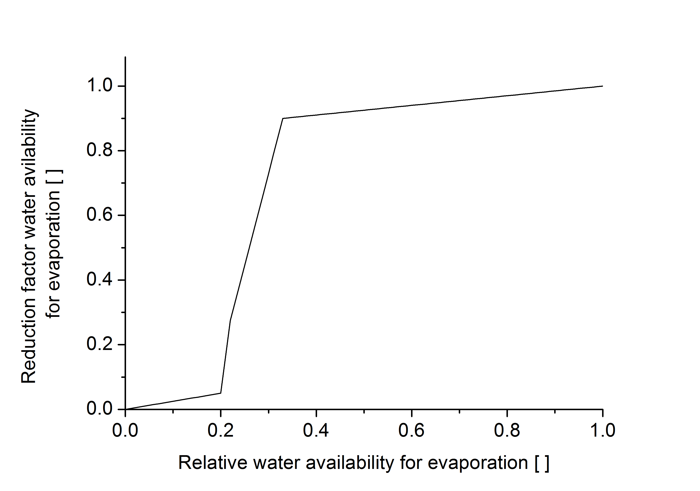

# Evaporation

Reference evapotranspiration for short-cut grass $`\small ET_0`$ is calculated using the Penman-Monteith method (1998).

$`\small ET_0 = \frac{0.408 \cdot \Delta \cdot (R_n - G) + \gamma \cdot \frac{900}{\gamma + 273} \cdot u_2 \cdot (e_s - e_a) } {\Delta + \gamma \cdot (1+\frac{r_a}{r_s})} `$

$`\small  \Delta`$	Slope of the vapour pressure curve	$`\small  [kPa\,K^{-1}]`$ 
$`\small  R_n`$	Net radiation at the crop surface	$`\small  [MJ\, m^{-2} \, d^{-1}]`$ 
$`\small  G`$	Soil heat flux density	$`\small  [MJ\, m^{-2} \, d^{-1}]`$ 
$`\small  T`$	Mean daily air temperature at 2 m height	$`\small  [^{\circ} C]`$ 
$`\small  u_2`$	Wind speed at 2 m height	$`\small  [m \, s^{-1}]`$ 
$`\small  e_s`$	Saturation vapour pressure	$`\small  [kPa]`$ 
$`\small  e_a`$	Actual vapour pressure	$`\small  [kPa]`$ 
$`\small  \gamma`$	Psychrometric constant	$`\small  [kPa \, K^{-1}]`$ 
$`\small  r_a`$	Atmospheric resistance	$`\small  [s\, m^{-1}]`$ 
$`\small  r_s`$	Surface resistance	$`\small  [s\, m^{-1}]`$ 

Crop-specific potential evapotranspiration is calculated using also crop-specific factors (Kc) during the crop’s growth period and a factor for bare soil between harvest and emergence of the subsequent crop. The Kc factors are coupled to the crop’s developmental stages.

$`\small ET_p = ET_0 \cdot k_c - I`$

$`\small ET_p`$	Potential evapotranspiration	$`\small [mm] `$ 
$`\small ET_0`$	Reference evapotranspiration	$`\small [mm] `$ 
$`\small k_c`$	crop-specific factor	  
$`\small I`$	Evaporation from interception storage	$`\small [mm] `$ 

To what extent evaporation contributes to total evapotranspiration is determined by the ground coverage.

$`\small E_p = ET_p \cdot (1-\beta) `$

$`\small E_p`$	Potential evaporation	$`\small [mm]`$ 
$`\small ET_p`$	Potential evapotranspiration	$`\small [mm]`$ 
$`\small \beta `$	Ground coverage	  

Evaporation is limited by water availability and the soil air vapour pressure gradient. The reduction factor $`\small \varepsilon_1(z) `$ which describes the limitation of evaporation by water availability is determined by an empirical HERMES function (Figure 1), for which the relative water availability is calculated as

$`\small W_{ERel}(z) =  \begin{cases} 0 & \theta<0.33 \cdot \theta_{PWP}  \\   \frac{\theta - (0.33 \cdot \theta_{PWP})} {\theta_{FC} - (0.33 \cdot \theta_{PWP})} & \theta \geq 0.33 \cdot \theta_{PWP} \end{cases} `$

$`\small W_{ERel}(z)`$	Relative water availability for evaporation in soil layer z	  
$`\small \theta `$	Water content in soil layer z	$`\small [m^3 \, m^{-3}]`$ 
$`\small \theta{PWP}`$	Water content at permanent wilting point in soil layer z	$`\small [m^3 \, m^{-3}]`$ 
$`\small \theta{FC}`$	Water content at field capacity in soil layer z	$`\small [m^3 \, m^{-3}]`$ 

Figure 1 : The reduction factor water availability for evaporation $`\varepsilon_2(z)`$ in relation to the relative water availability for evaporation {Kersebaum 1989}.

The limitation of evaporation by the soil air vapour pressure gradient is expressed in two further reduction factors. The first of them–referred to as the deprivation factor $`\varepsilon_2(z) `$ – considers the depth of the soil layer from which the water volume evaporates and thus–although implicitly–the slope of the vapour pressure gradient in the air-filled soil volume.

$`\small \varepsilon_2(z) = (a_1 - a_2) \cdot \frac{\zeta + 1} {log(\zeta + 1) - \zeta}`$

$`\small \varepsilon_2(z)`$	Reduction factor deprivation depth	  
$`\small \zeta`$	Curvature of the deprivation function	  

where

$`\small a_1 = log \left( \frac { \frac{Z_{E \,max}}{\Delta Z} + \zeta \cdot Z}  {\frac{Z_{E \,max}}{\Delta Z} + \zeta \cdot (z-1) }\right) `$

$`\small \zeta`$	Curvature of the deprivation function	  
$`\small Z_{E \, max}`$	Maximum impact depth of evaporation	$`\small [m] `$ 
$`\small z`$	Layer number	  
$`\small \Delta z`$	Layer depth	$`\small [m] `$ 

and

$`\small a_2 = \frac{\zeta} {\frac{Z_{E \, max}}{\Delta z} \cdot (\zeta + 1)} `$

$`\small \zeta`$	Curvature of the deprivation function	  
$`\small Z_{E \, max}`$	Maximum impact depth of evaporation	$`\small [m] `$ 
$`\small \Delta z`$	Layer depth	$`\small [m] `$ 

The second factor expresses is a simple way that almost no water vapour evaporates upwards from a soil layer if the adjacent layer above contains more water than the other because of a reverse vapour pressure gradient.

$`\small \varepsilon_3(z)=\begin{cases}0.1 & \theta_z \leq \theta_{z-1} \\1.0 & \theta_z > \theta_{z-1}\end{cases}`$

$`\small \varepsilon_3(z) `$	Reduction factor vapour pressure gradient in soil layer z	  
$`\small \theta`$	Water content in soil layer z	$`\small[m^3 \, m^{-3}] `$ 
$`\small \theta_{z-1}`$	Water content in soil layer z–1	$`\small[m^3 \, m^{-3}] `$ 

The reduction factors for evaporation simply merge to

$`\small \varepsilon_z = \varepsilon_1(z) \cdot \varepsilon_2(z) \cdot \varepsilon_3(z)`$

$`\small \varepsilon_z `$	Reduction factor for evaporation in soil layer z	  
$`\small \varepsilon_1(z)`$	Reduction factor water availability in soil layer z	  
$`\small \varepsilon_2(z)`$	Reduction factor deprivation depth	  
$`\small \varepsilon_3(z)`$	Reduction factor vapour pressure gradient in soil layer z	  

If water is ponding at the soil surface evaporation is only fed from this pond, assuming a 10% higher evaporation than from moist soil. If snow covers the soil, evaporation is set to zero. Sublimation of snow crystals is not explicitly modelled. However, the snow module considers this process in the snow ageing process.

The total actual evaporation adds up from the contribution of the affected layers.

$`\small E_a = \sum_{z=1}^{z_{max}} E_p \cdot \varepsilon_z `$

$`\small E_a`$	Actual evaporation	$`\small [mm]`$ 
$`\small E_p`$	Potential evaporation	$`\small [mm]`$ 
$`\small \varepsilon_z`$	Reduction factor for evaporation in soil layer z	  
$`\small z`$	Layer number	  
$`\small z_{Emax}`$	Lowest soil layer affected by evaporation	  
 