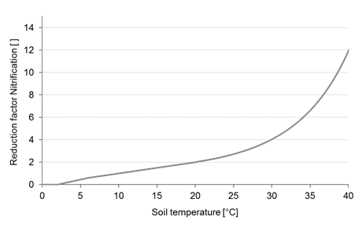
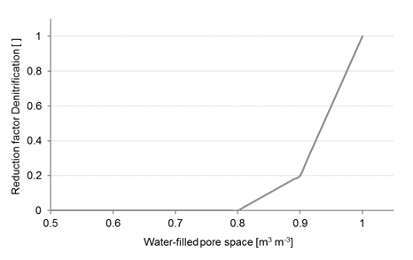

# Nitrification and Denitrification

The turn-over processes of ammonium to nitrate (nitrification) and of nitrate to dinitrogen (denitrification) are described as:

$`\small N = K_{NO} \cdot c_{NH^+_4} \cdot f_N(T) \cdot f_N(\theta)`$

$`\small N `$	Nitrification rate	$`\small [kg \, N \, m^{-3} \, d^{-1}] `$ 
$`\small K_{NO}`$	Nitrification rate coefficient at standard conditions	$`\small [d^{-1}] `$ 
$`\small c_{NH^+_4}`$	NH4+ concentration in soil	$`\small [kg \, N \, m^{-3}] `$ 
$`\small f_N(T)`$	Reduction factor temperature (Fig. 2) 
 
$`\small f_N(\theta) `$	Reduction factor soil moisture (Fig. 3)	 

 
Figure 1: $`\small f_N(\theta)`$ – Reduction factor for nitrification in dependence of the soil water potential (Abrahamsen and Hansen, 2000).

 
Figure 2: Reduction factor for nitrification (fN(T)) and denitrification (fD(T)) in dependence of soil temperature (Abrahamsen and Hansen, 2000).

$`\small D_{pot} = K_{DO} \cdot \Phi_{CO_2} \cdot f_D(T) `$

$`\small D_{pot} `$	Potential denitrification rate	$`\small [kg \, N \, m^{-3} \, d^{-1}] `$ 
$`\small K_{DO}`$	Anaerobic denitrification rate	$`\small [kg \, N \, m^{-3} \, d^{-1}] `$ 
$`\small \Phi_{CO_2}`$	Microbial CO2 release rate	$`\small [kg \, C \, d^{-1}] `$ 
$`\small f_D(T)`$	Reduction factor temperature (Fig. 2) 

 
Figure 3: $`\small f_D(\theta)`$ – Reduction factor for denitrification in dependence of water-filled pore space in soil (Abrahamsen and Hansen, 2000).

$`\small D_{act} = min \begin{cases} D_{pot} f_D(\theta) \\ V_{NO_3} \cdot C_{NO_3}  \end{cases} `$

$`\small D_act`$	Actual denitrification rate	$`\small [kg \, N \, m^{-3} \, d^{-1}] `$ 
$`\small D_pot`$	Potential denitrification rate	$`\small [kg \, N \, m^{-3} \, d^{-1}] `$ 
$`\small f_D(\theta)`$	Reduction factor soil moisture (Fig. )	$`\small [d^{-1}] `$ 
$`\small V_{NO_3}`$	Transport rate NO3-	$`\small [kg \, N \, m^{-3}] `$ 
$`\small C_{NO_3}`$	Soil NO3-  concentration	  

## References

* Abrahamsen, P., Hansen, S., 2000. Daisy: an open soil-crop-atmosphere system model. Environ. Mod. Software 15, 313-330.