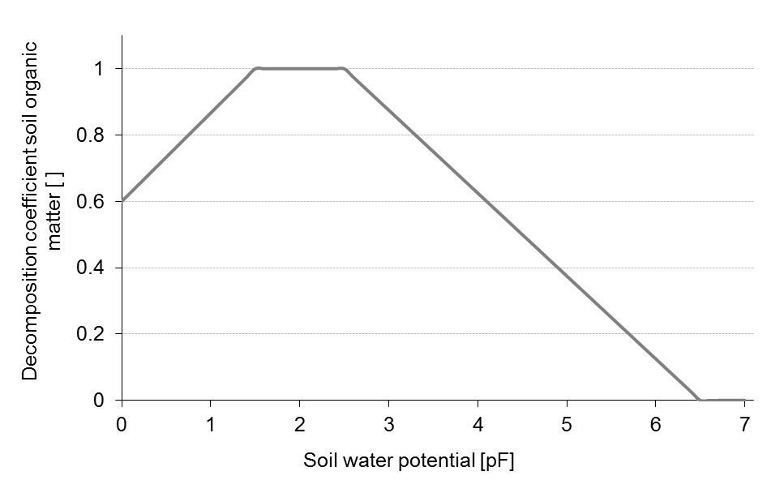
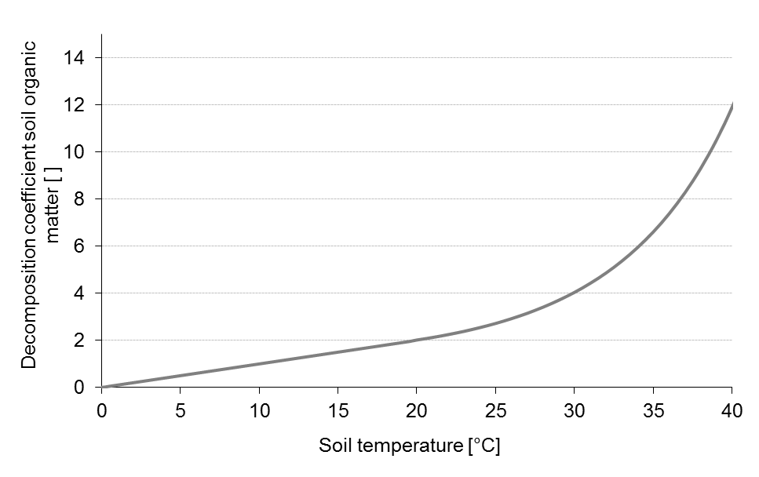
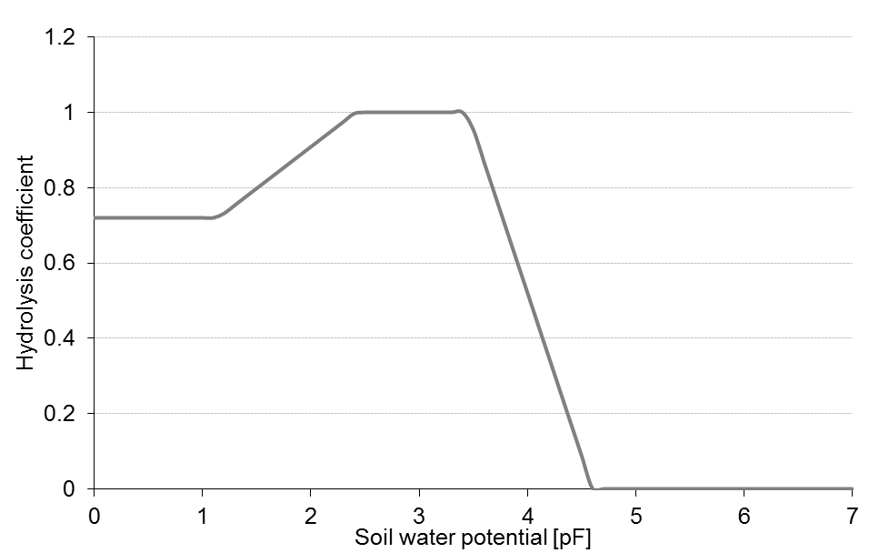

# Umsatz organischer Substanz

Die Berechnung des Umsatzes organischer Substanz im Boden basiert auf Routinen, die im DAISY-Modell verwendet werden (Hansen et al., 1991). Die Kohlenstoffdynamik im Boden wird mit Hilfe von drei Paaren (schnelle und langsame Umsetzung) konzeptioneller Pools (Humus, mikrobielle Biomasse und frische organische Substanz) beschrieben.

Die Ratenkoeffizienten der Abbauprozesse sind temperatur-  und feuchteabhängig und bilden die Umweltbedingungen des simulierten Standorts ab. Abbau- und Atmungsraten der mikrobiellen Biomasse sind zusätzlich vom Tongehalt des Bodens beeinflusst.

Effizienzparameter bestimmen den Verlust von CO2 während der einzelnen Umsatzprozesse. N-Freisetzung in Form von NH4+ ist eine Konsequenz des C-Verlustes als CO2 aus dem System, in dem ansonsten konstante C-N-Verhältnisse für die Pools gewahrt werden.Abbildung: Strukturdiagramm des Umsatzmoduls für organische Substanz. AOM = Frische organische Substanz; SMB = Mikrobielle Biomasse; SOM = Humus, jeweils charakterisiert durch eine schnelle (fast) oder langsame (slow) Umsatzrate. r0 =  Umsatzrate bei Standardbedingungen; rdeath = Sterberate der mikrobiellen Biomasse; rmaint = Erhaltungsatmung  der mikrobiellen Biomasse; f(Ton), f(T), f() =  Abbaukoeffizienten für organische Bodensubstanz in Abhängigkeit vom Tongehalt, der Temperatur und der Feuchte des Bodens (Abrahamsen and Hansen, 2000).

Abbildung: Strukturdiagramm des Umsatzmoduls für organische Substanz. AOM = Frische organische Substanz; SMB = Mikrobielle Biomasse; SOM = Humus, jeweils charakterisiert durch eine schnelle (fast) oder langsame (slow) Umsatzrate. r0 =  Umsatzrate bei Standardbedingungen; rdeath = Sterberate der mikrobiellen Biomasse; rmaint = Erhaltungsatmung  der mikrobiellen Biomasse; $`\small f(TON), \, f(T), \, f(\theta) = `$   Abbaukoeffizienten für organische Bodensubstanz in Abhängigkeit vom Tongehalt, der Temperatur und der Feuchte des Bodens (Abrahamsen and Hansen, 2000).
 

Abbildung: f(Ton) – Abbaukoeffizient für organische Bodensubstanz in Abhängigkeit vom Tongehalt des Bodens (Abrahamsen and Hansen, 2000).

Abbildung: $`\small f(theta) `$ – Abbaukoeffizient für organische Bodensubstanz in Abhängigkeit von der Wasserspannung im Boden (Abrahamsen and Hansen, 2000).

Abbildung: f(T) – Abbaukoeffizient für organische Bodensubstanz in Abhängigkeit von der Bodentemperatur (Abrahamsen and Hansen, 2000).

Im Feld verbleibende Rückstände der mit dem Pflanzenwachstumsmodul simulierten Pflanzen werden dem Mineralisationsprozess mit einem dynamischen C-N-Verhältnis zugeführt. Dieses errechnet sich aus der Rückstandsmenge, dem N-Gesamtgehalt der Pflanze und einem Gewichtungsfaktor, der den N-Gehalt der Pflanzenrückstände im Verhältnis zum N-Gehalt des marktfähigen Anteils angibt. Es reflektiert die Wachstumsbedingungen des Bestands während der Saison bezüglich der N-Versorgung und stammt aus dem Modell EU‑Rotate_N (Rahn et al., 2010). Während dem langsam abbaubaren Anteil des Pflanzenmaterials ein konstantes C-N-Verhältnis zugeordnet ist, variiert das C-N-Verhältnis des schnell abbaubaren Anteils in Abhängigkeit vom N-Gesamtgehalt in der Pflanze.

$`\small CN(AOM_f) = \frac{C_{AOM} \cdot f(AOM_f)} {N_{AOM} - \left(  \frac{C_{AOM} \cdot f(AOM_s)} {CN(AOM_s)}   \right)} `$

Hier bezeichnet CN das C-N-Verhältnis, CAOM den C-Gehalt und NAOM den N-Gehalt der zugeführten organischen Substanz (AOM). f ist der jeweilige Anteil von AOM der der schnell (AOMf) oder der langsam (AOMs) abbaubaren Fraktion zugeordnet wird. Die Abbauratenkoeffizienten der beiden Pools sind ebenfalls konstant (Abrahamsen and Hansen, 2000).

Die C-N-Verhältnisse und Partitionierungskoeffizienten für verschiedene Pflanzenrückstände wurden mit Hilfe der stufenweisen chemischen Fraktionierung bestimmt (Jensen et al., 2005). Parameter für die Freisetzung von N aus Festmist und Gülle wurden dem DAISY-Model entlehnt (Abrahamsen and Hansen, 2000). Pflanzenrückstände mit einem weiten C-N-Verhältnis führen dazu, dass mineralisches N im Boden von Mikroorganismen immobilisiert wird. Im Falle dass mineralisches N im Boden nicht ausreichend vorhanden ist, werden die Abbauprozesse in den verschiedenen Pools, deren N-Bilanz negativ ist, unterbrochen.

N-Volatilisation von Stallmist und Gülle wird mit Hilfe einer empirischen Funktion beschrieben, die im ALFAM-Modell (Søgaard et al., 2002) implementiert ist. Eine Funktion, die zusätzlich die Abhängigkeit der Ausgasung N-haltiger Verbindungen vom Boden-pH beschreibt, wurde aus Daten von He et al. (He et al., 1999) abgeleitet. Dazu wurde eine Michaelis-Menten-Kinetik an die Daten angepasst und anschließend die Beziehung zwischen pH und der Halbwertszeit der N-Volatilisation auf pH 7.0 normiert.

Die Hydrolyse von Harnstoff und die entsprechend folgenden gasförmigen N-Verluste nach der Applikation von Harnstoffdünger werden auf der Grundlage des Modells AMOVOL (Sadeghi 1988) berechnet. Dabei werden das temperaturabhängige Gleichgewicht zwischen Ammonium-Ionen in Lösung und gasförmigem Ammoniak, sowie der Effekt der organischen Bodensubstanz, der Bodentemperatur und des Bodenwassergehalts auf den Hydrolyse-Prozess selbst berücksichtigt. Der atmosphärische Widerstand der Grenzoberfläche bestimmt letztendlich den Verlust gasförmigen Ammoniaks aus dem Boden.

## Literatur

* Abrahamsen, P., Hansen, S., 2000. Daisy: an open soil-crop-atmosphere system model. Environ. Mod. Software 15, 313-330.

* Hansen, S., Jensen, H.E., Nielsen, N.E., Svendsen, H., 1991. Simulation of nitrogen dynamics and biomass production in winter-wheat using the Danish simulation-model DAISY. Fert. Res. 27 (2-3), 245-259.

* He, Z.L., Alva, A.K., Calvert, D.V., Banks, D.J., 1999. Ammonia volatilization from different fertilizer sources and effects of temperature and soil pH. Soil Sci. 164 (10), 750-758.

* Jensen, L.S., Salo, T., Palmason, F., Breland, T.A., Henriksen, T.M., Stenberg, B., Pedersen, A., Lundström, C., Esala, M., 2005. Influence of biochemical quality on C and N mineralisation from a broad variety of plant materials in soil. Plant Soil 273, 307-326.

* Rahn, C.R., Zang, K., Lillywhite, R.D., Ramos, C., de Paz, J.M., Doltra, J., Riley, H., Fink, M., Nendel, C., Thorup-Kristensen, K., Pedersen, A., Piro, F., Venezia, A., Firth, C., Schmutz, U., Rayns, F., Strohmeyer, K., 2010. EU-Rotate_N - a European decision support system to predict environmental and economic consequences of the management of nitrogen fertiliser in crop rotations. Eur. J. Hort. Sci. 75 (1), 20-32.

* Søgaard, H.T., Sommer, S.G., Hutchings, N.J., Huijsmans, J.F.M., Bussink, D.W., Nicholson, F., 2002. Ammonia volatilization from field-applied animal slurry - the ALFAM model. Atmos. Environ. 36 (20), 3309-3319.