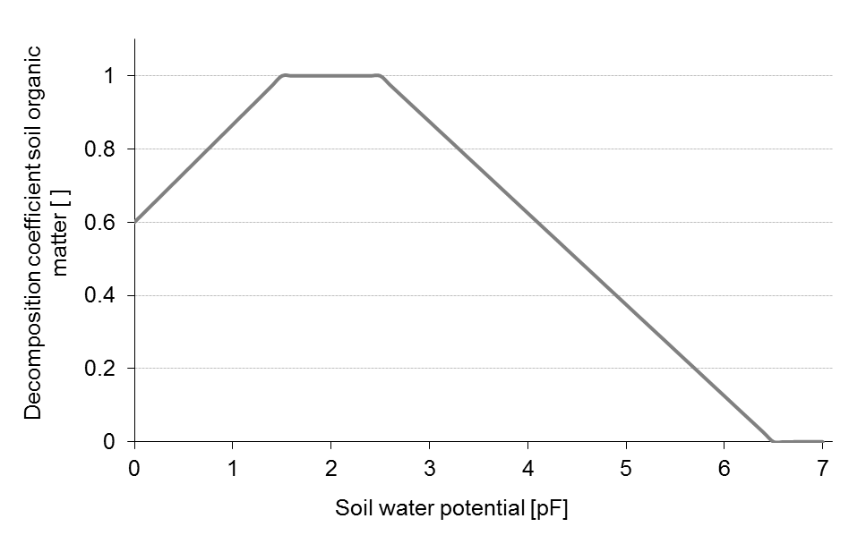
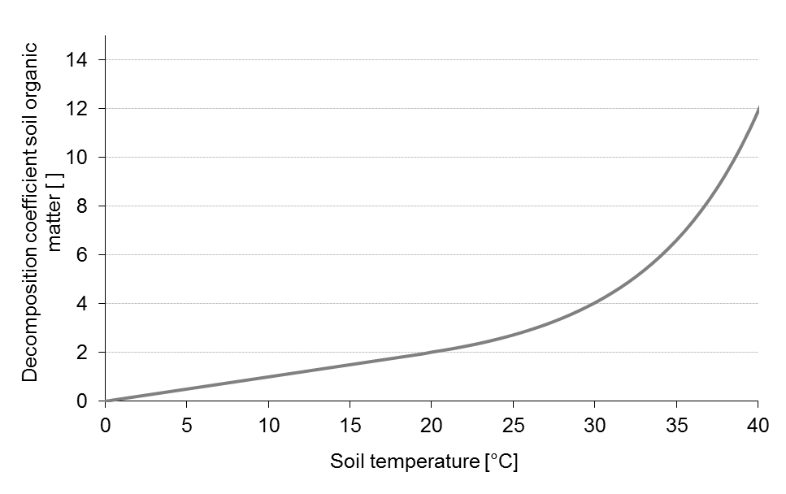
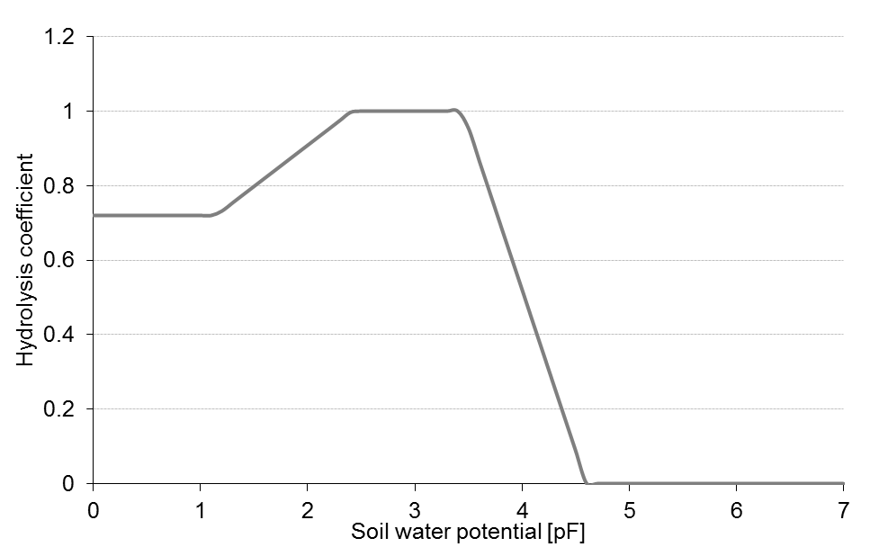

# Organic matter turn-over

The calculation of organic matter turn-over is based on algorithms used in the DAISY model (Hansen et al., 1991). Soil carbon dynamics is described using three pairs (rapid and slow turn-over) of conceptional pools (soil organic matter, microbial biomass and freshly added organic matter).

Rate coefficients of decomposition are dependent on soil temperature and moisture and describe the environemntal conditions of the simulated site. Microbial biomass death and respiration rates are additionally influenced by soil clay content.

Efficiency parameters govern CO2 emissions for the single turn-over processes. N release as NH4+ is a consequence of C losses in form of CO2 from the system, in which constant C-to-N ratios are maintained for the conceptional pools.

cheme of the organic matter turn-over module. AOM = added organic matter pool; SMB = soil microbial biomass pool; SOM = soil organic matter pool, each of which is characterised by a rapid and a slow decomposition rate.

Figure 1: Scheme of the organic matter turn-over module. AOM = added organic matter pool; SMB = soil microbial biomass pool; SOM = soil organic matter pool, each of which is characterised by a rapid and a slow decomposition rate. r0 =  turn-over rate at standard conditions; rdeath = death rate of microbial biomass; rmaint = maintenance respiration of microbial biomass; $`\small f(clay), \, f(T), \, f(\theta) = `$  decomposition artes for soil organic matter in dependence of soil clay content, temperature and moisture (Abrahamsen and Hansen, 2000).

Figure 2: f(clay) – Decomposition coefficient for soil organic matter in dependence of soil clay content (Abrahamsen and Hansen, 2000).

Figure 3: $`\small f(theta) `$ – Decomposition coefficient for soil organic matter in dependence of soil water potential (Abrahamsen and Hansen, 2000).

Figure 4: f(T) – Decomposition coefficient for soil organic matter in dependence of soil temperature (Abrahamsen and Hansen, 2000).

Residues of the virtual plant remaining in the field are assigned a dynamic C-to-N ratio and passed on to the mineralisation process. The residue’s total N content is then calculated from ist amount, the total N content of the crop, and a factor which denotes the crop residue’s N concentration in relation to that of the marketable yield. This approach reflects the N nutrition of the crop during the season and was taken from the EU‑Rotate_N simulation model (Rahn et al., 2010). While slowly decomposing parts of the plant material are assigned a constant C-to-N ratio, the C-to-N ratio of the rapidly decomposing parts vary in relation to the plant’s total N content as:

$`\small CN(AOM_f) = \frac{C_{AOM} \cdot f(AOM_f)} {N_{AOM} - \left(  \frac{C_{AOM} \cdot f(AOM_s)} {CN(AOM_s)}   \right)} `$

where CN denotes the C-to-N ratio, CAOM the C concentration and NAOM the N concentration in the added organic matter (AOM). f is the part of AOM which is assigned rapidly (AOMf) or slowly (AOMs) decomposing fractions. The decomposition rate coefficients of both pools are constant (Abrahamsen and Hansen, 2000).

C-to-N ratios and partitioning coefficients for different crop residues were determined using stepwise chemical digestion (Jensen et al., 2005). Parameters for N release from manure and slurry were taken from the DAISY model (Abrahamsen and Hansen, 2000). Crop residues having a wide C-to-N ratio induce immobilisation of mineral N in soil. In the case of insufficient mineral N being available in soil all decomposition processes with a negative N balance cease.

N volatilisation of manure and slurry is described using an empirical function of the ALFAM model (Søgaard et al., 2002). Another function to describe the dependency of gaseous N emmissions from soil pH was derived from data published by He et al. (1999) abgeleitet. A Michaelis-Menten kinetic was fitted to their data and the relation between pH and N volatilisation half-life was normalised to pH 7.0.

Urea hydrolysis and the respective gaseous N losses after application of urea-based fertilisers are caluated using algorithms of the AMOVOL model (Sadeghi 1988). It considers the temperature-dependent equilibrium between ammonium ions in solution and gaseous ammonia, as well as effects of soil organic matter content, soil temperature and soil moisture content on hydrolysis. The atmospheric resistance finally governs the loss of gaseous ammonia from soil.

## References

* Abrahamsen, P., Hansen, S., 2000. Daisy: an open soil-crop-atmosphere system model. Environ. Mod. Software 15, 313-330.

* Hansen, S., Jensen, H.E., Nielsen, N.E., Svendsen, H., 1991. Simulation of nitrogen dynamics and biomass production in winter-wheat using the Danish simulation-model DAISY. Fert. Res. 27 (2-3), 245-259.

* He, Z.L., Alva, A.K., Calvert, D.V., Banks, D.J., 1999. Ammonia volatilization from different fertilizer sources and effects of temperature and soil pH. Soil Sci. 164 (10), 750-758.

* Jensen, L.S., Salo, T., Palmason, F., Breland, T.A., Henriksen, T.M., Stenberg, B., Pedersen, A., Lundström, C., Esala, M., 2005. Influence of biochemical quality on C and N mineralisation from a broad variety of plant materials in soil. Plant Soil 273, 307-326.

* Rahn, C.R., Zang, K., Lillywhite, R.D., Ramos, C., de Paz, J.M., Doltra, J., Riley, H., Fink, M., Nendel, C., Thorup-Kristensen, K., Pedersen, A., Piro, F., Venezia, A., Firth, C., Schmutz, U., Rayns, F., Strohmeyer, K., 2010. EU-Rotate_N - a European decision support system to predict environmental and economic consequences of the management of nitrogen fertiliser in crop rotations. Eur. J. Hort. Sci. 75 (1), 20-32.

* Søgaard, H.T., Sommer, S.G., Hutchings, N.J., Huijsmans, J.F.M., Bussink, D.W., Nicholson, F., 2002. Ammonia volatilization from field-applied animal slurry - the ALFAM model. Atmos. Environ. 36 (20), 3309-3319.