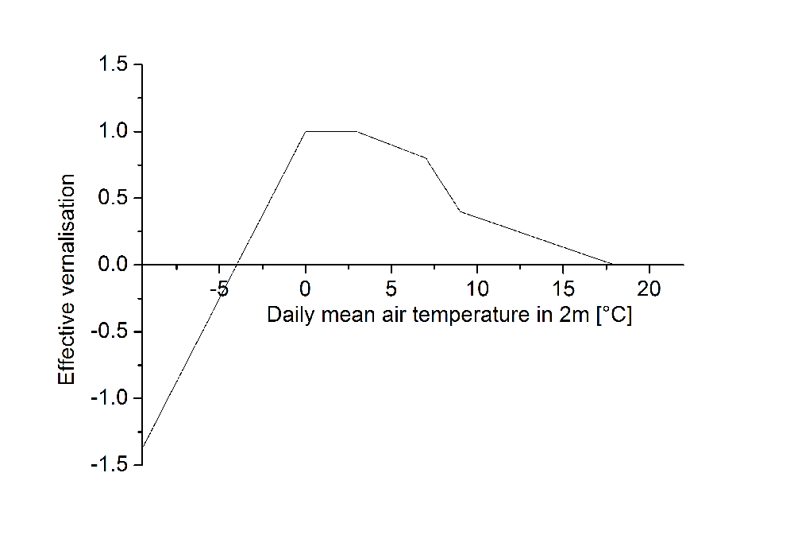

# Ontogenesis

The plant development is simulated using the principle of heat summation. The effective temperature is limited by a minimum temperature, which is referred to as base temperature. Suitable soil moisture is required for the emergence of the seeds, which is at least 30% of the available water. Ponding at the soil surface would hinder seed emergence. If soil moisture is ideal, the topsoil layer’s temperature will be used for heat summation.

$$DD_{0, t} = DD_{0,t-1} + (T_{S10} - T_{B0}) \cdot \Delta t$$

$DD_{0, t}$	Actual temperature sum in developmental stage 0	$[^{\circ} C \, d]$ 
$DD_{0, t-1}$ Yesterday’s temperature sum in developmental stage 0 $[^{\circ} C \, d]$ 
$T_{S10}$ Soil temperature in 0–10 cm depth	$[^{\circ} C]$ 
$T_{B0}$ Base temperature developmental stage 0	$[^{\circ} C]$ 
$\Delta t$ Time step $[d]$ 

As soon as the crop-specific temperature sum for seed emergence is reached, the following developmental stage is initiated. From this time on the daily mean temperature will be summed up. Stress factors drought and N deficiency accelerate the summation, while vernalisation and day length factors decelerate it:

$$DD_{n,t} =  DD_{n,t-1} + (T_{av} - T_{Bn}) \cdot b_s \cdot b_v \cdot b_D \cdot \Delta t$$

$DD_{n,t}$ Actual temperature sum in developmental stage $n$ $[^{\circ} C \, d]$ 
$DD_{n,t-1}$ Yesterday’s temperature sum in developmental stage $n$	$[^{\circ} C \, d]$ 
$T_{av}$ Daily mean air temperature in 2 m height $[^{\circ} C]$ 
$T_{Bn}$ Base temperature developmental stage n	$[^{\circ} C]$ 
$b_s$ Acceleration factor environmental stress 
$b_v$ Vernalisation factor 
$b_D$ Day length factor 
$\Delta t$ Time step $[d]$ 

where

$$b_s = max( 1 + ( 1 - \zeta_W)^2, 1 + (1-\zeta_N)^2  )$$

$b_s$ Acceleration factor environmental stress 
$\zeta_w$ Stress factor drought 
$\zeta_N$ Stress factor N deficiency 

Satisfaction of the crop’s vernalisation requirement is considered as follows:

$$b_V = \begin{cases}  \frac{(d_V - d_{VT})}{(d_{VR} - d_{VT})} & d_{VT} \geq 1 \\ 1 & d_{VT}<1  \end{cases}$$

{ width="50%"}

*Figure 1: Effective vernalisation in relation to the daily mean air temperature.*

$b_V$ Vernalisation factor 
$d_V$ Current number of vernalisation days $[d]$ 
$d_{VT}$ Vernalisation threshold $[^{\circ} C \, d]$ 
$d_{VR}$ Crop-specific vernalisation requirement $[^{\circ} C \, d]$ 

where

$$d_V = d_{V-1} + b_{V_{eff}} \cdot \Delta t$$

$d_V$ Current number of vernalisation days $[d]$ 
$d_{V-1}$ Number of vernalisation days until yesterday $[d]$ 
$b_{V_{eff}}$ Effective vernalisation 
$\Delta t$ Time step $[d]$ 

and

$$d_{VT} = min( d_{VR}, 9 ) - 1$$

$d_{VT}$ Vernalisation threshold $[^{\circ} C \, d]$ 
$d_{VR}$ Crop-specific vernalisation requirement $[^{\circ} C \, d]$ 

The vernalisation factor is always positive.

Day length is considered in relation to a crop-specific base day length and to the crop’s day length requirement:

$$b_D = \frac{N_{photo} - N_{basis}}{N_{req} - N_{basis}}$$

$b_D$ Day length factor 
$N_{photo}$	Photoperiodic day length $[h]$ 
$N_{basis}$	Crop-specific base day length $[h]$ 
$N_{req}$ Crop-specific day length requirement $[h]$ 