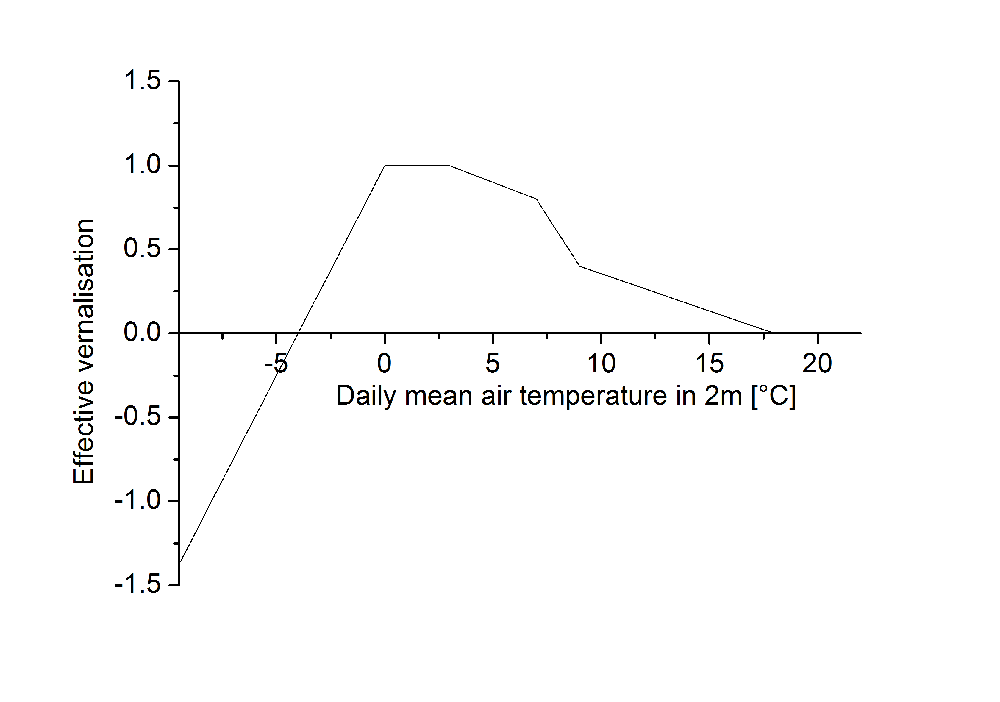
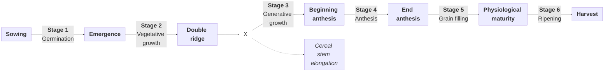
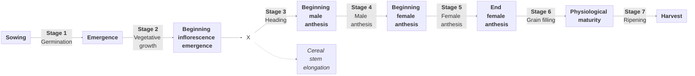

# Phenology

MONICA simulates crop phenology based on the temperature sums required to complete a developmental stage.

To do so, MONICA calculates the accumulated mean air temperature above crop-specific base air and soil temperatures, further restricted by soil moisture and nitrogen availability, vernalisation, and daylength requirements.

As soon as the required temperature is reached, the developmental stage advances.

---

## Crop ontogenesis

The plant development is simulated using the principle of heat summation. The effective temperature is limited by a minimum temperature, which is referred to as base temperature. Suitable soil moisture is required for the emergence of the seeds, which is at least 30% of the available water. Ponding at the soil surface would hinder seed emergence. If soil moisture is ideal, the topsoil layer’s temperature will be used for heat summation.

$$DD_{0, t} = DD_{0,t-1} + (T_{S10} - T_{B0}) \cdot \Delta t$$

$DD_{0, t}$	Actual temperature sum in developmental stage 0	$[^{\circ} C \, d]$ 
$DD_{0, t-1}$ Yesterday’s temperature sum in developmental stage 0 $[^{\circ} C \, d]$ 
$T_{S10}$ Soil temperature in 0–10 cm depth	$[^{\circ} C]$ 
$T_{B0}$ Base temperature developmental stage 0	$[^{\circ} C]$ 
$\Delta t$ Time step $[d]$ 

As soon as the crop-specific temperature sum for seed emergence is reached, the following developmental stage is initiated. From this time on the daily mean temperature will be summed up. Stress factors drought and N deficiency accelerate the summation, while vernalisation and day length factors decelerate it:

$$DD_{n,t} =  DD_{n,t-1} + (T_{av} - T_{Bn}) \cdot b_s \cdot b_v \cdot b_D \cdot \Delta t$$

$DD_{n,t}$ Actual temperature sum in developmental stage $n$ $[^{\circ} C \, d]$ 
$DD_{n,t-1}$ Yesterday’s temperature sum in developmental stage $n$	$[^{\circ} C \, d]$ 
$T_{av}$ Daily mean air temperature in 2 m height $[^{\circ} C]$ 
$T_{Bn}$ Base temperature developmental stage n	$[^{\circ} C]$ 
$b_s$ Acceleration factor environmental stress 
$b_v$ Vernalisation factor 
$b_D$ Day length factor 
$\Delta t$ Time step $[d]$ 

where

$$b_s = max( 1 + ( 1 - \zeta_W)^2, 1 + (1-\zeta_N)^2  )$$

$b_s$ Acceleration factor environmental stress 
$\zeta_w$ Stress factor drought 
$\zeta_N$ Stress factor N deficiency 

Satisfaction of the crop’s vernalisation requirement is considered as follows:

$$b_V = \begin{cases}  \frac{(d_V - d_{VT})}{(d_{VR} - d_{VT})} & d_{VT} \geq 1 \\ 1 & d_{VT}<1  \end{cases}$$

{ width="50%"}

*Figure 1: Effective vernalisation in relation to the daily mean air temperature.*

$b_V$ Vernalisation factor 
$d_V$ Current number of vernalisation days $[d]$ 
$d_{VT}$ Vernalisation threshold $[^{\circ} C \, d]$ 
$d_{VR}$ Crop-specific vernalisation requirement $[^{\circ} C \, d]$ 

where

$$d_V = d_{V-1} + b_{V_{eff}} \cdot \Delta t$$

$d_V$ Current number of vernalisation days $[d]$ 
$d_{V-1}$ Number of vernalisation days until yesterday $[d]$ 
$b_{V_{eff}}$ Effective vernalisation 
$\Delta t$ Time step $[d]$ 

and

$$d_{VT} = min( d_{VR}, 9 ) - 1$$

$d_{VT}$ Vernalisation threshold $[^{\circ} C \, d]$ 
$d_{VR}$ Crop-specific vernalisation requirement $[^{\circ} C \, d]$ 

The vernalisation factor is always positive.

Day length is considered in relation to a crop-specific base day length and to the crop’s day length requirement:

$$b_D = \frac{N_{photo} - N_{basis}}{N_{req} - N_{basis}}$$

$b_D$ Day length factor 
$N_{photo}$	Photoperiodic day length $[h]$ 
$N_{basis}$	Crop-specific base day length $[h]$ 
$N_{req}$ Crop-specific day length requirement $[h]$ 

---

## Crop-specific phenology

MONICA models the development process through thermal time (the temperature sum) being accumulated throughout six successive stages, starting from sowing up until harvest. The stage 1 (germination) where the soil temperature at a 10 cm soil level determines development. This starts once the soil temperature is above the base temperature (TempBase) and continues until the temperature sum is greater than the threshold for that stage (StageTemperatureSum). At this point, the plant moves into the Stage 2, indicating emergence. Alternatively, the crop may emerge based on the moisture and flooding state of the soil if the variables EmergenceMoistureControlOn and EmergenceFloodingControlOn in sim.json are TRUE.

Starting from Stage 2, the use of soil temperature is replaced with Tempavg. In the case when Tempavg is higher than TempBase each day, the temperature sum will increase; otherwise, the crop stays in the same stage. As soon as the accumulated temperature sum surpasses the threshold for that particular stage, the crop moves to the next stage. During this process, both the Julian day and water and nitrogen availability (H2O/N availability) are tracked. The vernalization factor applies only to winter crops and requires that they should have been exposed to a necessary amount of frost days to continue their development. Another limiting factor for the growth process is the length of a day, which distinguishes between long-day and short-day crops. All these criteria should be fulfilled in order for the crop to move to the next stage. In addition, there are limiting factors associated with unfavorable temperature conditions and lack of water and nitrogen needed to develop properly (e.g., grain filling). The values for all these factors are defined in the cultivar-specific JSON files.

The following sections describe the crop-specific phenological development currently implemented in MONICA.

### Cereals

#### Overview

#### Stage definitions

|   Stage   | MONICA event name          | Physiological name | From                   | To                     |  From BBCH  |  To BBCH   | Notes                                                                                     |
|:---------:|----------------------------|--------------------|------------------------|------------------------|:-----------:|:----------:|-------------------------------------------------------------------------------------------|
|     1     | **emergence**              | germination        | sowing                 | emergence              |      0      |     9      |                                                                                           |
|     2     |                            | vegetative growth  | emergence              | double ridge           |     10      |  &ndash;   |                                                                                           |
|     3     |                            | generative growth  | double ridge           | beginning anthesis     |   &ndash;   |     60     |                                                                                           |
|     4     | **anthesis**               | anthesis           | beginning anthesis     | end anthesis           |     61      |     70     |                                                                                           |
|     5     | **maturity**               | grain filling      | end anthesis           | physiological maturity |     71      |     90     |                                                                                           |
|     6     |                            | ripening           | physiological maturity | harvest                |     91      |     99     |                                                                                           |
|  &ndash;  | **cereal-stem-elongation** |                    |                        |                        |     31      |     31     | Calculated as soon as 25% of the temperature sum required to complete Stage 3 is reached. |

### Maize

|   Stage   | MONICA event name          | Physiological name    | From                              | To                                | From BBCH | To BBCH | Notes                                                                                     |
|:---------:|----------------------------|-----------------------|-----------------------------------|-----------------------------------|:---------:|:-------:|-------------------------------------------------------------------------------------------|
|     1     | **emergence**              | germination           | sowing                            | emergence                         |     0     |    9    |                                                                                           |
|     2     |                            | vegetative growth     | emergence                         | beginning inflorescence emergence |    10     |   50    |                                                                                           |
|     3     |                            | heading               | beginning inflorescence emergence | beginning male anthesis           |    51     |   60    |                                                                                           |
|     4     |                            | male anthesis         | beginning male anthesis           | beginning female anthesis         |    61     |   64    |                                                                                           |
|     5     |                            | female anthesis       | beginning female anthesis         | end female anthesis               |    65     |   70    |                                                                                           |
|     6     |                            | grain filling         | end female anthesis               | physiological maturity            |    71     |   90    |                                                                                           |
|     7     |                            | ripening              | physiological maturity            | harvest                           |    91     |   99    |                                                                                           |
| &ndash;   | **cereal-stem-elongation** |                       |                                   |                                   |    31     |   31    | Calculated as soon as 25% of the temperature sum required to complete Stage 3 is reached. |

### Oilseed rape

```mermaid
%%{init: {
  "theme": "default",
  "themeVariables": {
    "fontSize": "38px"
  },
  "flowchart": {
    "nodeSpacing": 90,
    "rankSpacing": 140
  }
}}%%

flowchart LR

    A["<b>Sowing</b>"]
    B["<b>Emergence</b>"]
    C["<b>Beginning stem elongation</b>"]
    D["<b>Beginning anthesis</b>"]
    E["<b>End anthesis</b>"]
    F["<b>Physiological maturity</b>"]
    G["<b>Harvest</b>"]

    A -->|<b>Stage 1</b><br>Germination| B
    B -->|<b>Stage 2</b><br>Vegetative growth| C
    C -->|<b>Stage 3</b><br>Heading| D
    D -->|<b>Stage 4</b><br>Anthesis| E
    E -->|<b>Stage 5</b><br>Grain filling| F
    F -->|<b>Stage 6</b><br>Ripening| G
```

|   Stage   | MONICA event name | Physiological name | From                      | To                        | From BBCH | To BBCH | Notes |
|:---------:|-------------------|--------------------|---------------------------|---------------------------|:---------:|:-------:|-------|
|     1     | **emergence**     | germination        | sowing                    | emergence                 |     0     |    9    |       |
|     2     |                   | vegetative growth  | emergence                 | beginning stem elongation |    10     |   30    |       |
|     3     |                   | heading            | beginning stem elongation | beginning anthesis        |    31     |   60    |       |
|     4     | **anthesis**      | anthesis           | beginning anthesis        | end anthesis              |    61     |   70    |       |
|     5     | **maturity**      | grain filling      | end anthesis              | physiological maturity    |    71     |   90    |       |
|     6     |                   | ripening           | physiological maturity    | harvest                   |    91     |   99    |       |

### Sugar beet

```mermaid
%%{init: {
  "theme": "default",
  "themeVariables": {
    "fontSize": "38px"
  },
  "flowchart": {
    "nodeSpacing": 90,
    "rankSpacing": 140
  }
}}%%

flowchart LR

    A["<b>Sowing</b>"]
    B["<b>Emergence</b>"]
    C["<b>10-leaf</b>"]
    D["<b>Beginning tuber growth</b>"]
    E["<b>Beginning leaf senescence</b>"]
    F["<b>Physiological maturity</b>"]
    G["<b>Harvest</b>"]

    A -->|<b>Stage 1</b><br>Germination| B
    B -->|<b>Stage 2</b><br>Leaf development| C
    C -->|<b>Stage 3</b><br>Vegetative growth| D
    D -->|<b>Stage 4</b><br>Generative growth| E
    E -->|<b>Stage 5</b><br>Leaf senescence| F
    F -->|<b>Stage 6</b><br>Ripening| G
```

|   Stage   | MONICA event name | Physiological name | From                      | To                           | From BBCH  |  To BBCH   | Notes |
|:---------:|-------------------|--------------------|---------------------------|------------------------------|:----------:|:----------:|-------|
|     1     | **emergence**     | germination        | sowing                    | emergence                    |     0      |     9      |       |
|     2     |                   | leaf development   | emergence                 | 10-leaf                      |     10     |     20     |       |
|     3     |                   | vegetative growth  | 10-leaf                   | beginning tuber growth       |     21     |     39     |       |
|     4     |                   | generative growth  | beginning tuber growth    | beginning leaf senescence    |     40     |  &ndash;   |       |
|     5     |                   | leaf senescence    | beginning leaf senescence | physiological maturity       |  &ndash;   |  &ndash;   |       |
|     6     |                   | ripening           | physiological maturity    | harvest                      |  &ndash;   |     49     |       |

### Potato

```mermaid
%%{init: {
  "theme": "default",
  "themeVariables": {
    "fontSize": "38px"
  },
  "flowchart": {
    "nodeSpacing": 90,
    "rankSpacing": 140
  }
}}%%

flowchart LR

    A["<b>Sowing</b>"]
    B["<b>Emergence</b>"]
    C["<b>Canopy closed</b>"]
    D["<b>Beginning tuber growth</b>"]
    E["<b>Beginning leaf senescence</b>"]
    F["<b>Physiological maturity</b>"]
    G["<b>Harvest</b>"]

    A -->|<b>Stage 1</b><br>Germination| B
    B -->|<b>Stage 2</b><br>Leaf development| C
    C -->|<b>Stage 3</b><br>Vegetative growth| D
    D -->|<b>Stage 4</b><br>Generative growth| E
    E -->|<b>Stage 5</b><br>Leaf senescence| F
    F -->|<b>Stage 6</b><br>Ripening| G
```

|   Stage   | MONICA event name | Physiological name | From                      | To                           | From BBCH |  To BBCH  | Notes |
|:---------:|-------------------|--------------------|---------------------------|------------------------------|:---------:|:---------:|-------|
|     1     | **emergence**     | germination        | sowing                    | emergence                    |     0     |     9     |       |
|     2     |                   | leaf development   | emergence                 | canopy closed                |    10     |    39     |       |
|     3     |                   | vegetative growth  | canopy closed             | beginning tuber growth       | &ndash;   | &ndash;   |       |
|     4     |                   | generative growth  | beginning tuber growth    | beginning leaf senescence    |    40     | &ndash;   |       |
|     5     |                   | leaf senescence    | beginning leaf senescence | physiological maturity       | &ndash;   | &ndash;   |       |
|     6     |                   | ripening           | physiological maturity    | harvest                      | &ndash;   |    49     |       |
