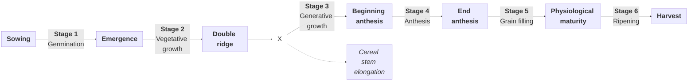

# Phenology

MONICA simulates crop phenology based on the temperature sums required to complete a developmental stage.

To do so, MONICA calculates the accumulated mean air temperature above crop-specific base air and soil temperatures, further restricted by soil moisture and nitrogen availability, vernalisation, and daylength requirements.

As soon as the required temperature is reached, the developmental stage advances.

## Cereals

### Overview

### Stage definitions

|   Stage   | MONICA event name          | Physiological name | From                   | To                     |  From BBCH  |  To BBCH   | Notes                                                                                     |
|:---------:|----------------------------|--------------------|------------------------|------------------------|:-----------:|:----------:|-------------------------------------------------------------------------------------------|
|     1     | **emergence**              | germination        | sowing                 | emergence              |      0      |     9      |                                                                                           |
|     2     |                            | vegetative growth  | emergence              | double ridge           |     10      |  &ndash;   |                                                                                           |
|     3     |                            | generative growth  | double ridge           | beginning anthesis     |   &ndash;   |     60     |                                                                                           |
|     4     | **anthesis**               | anthesis           | beginning anthesis     | end anthesis           |     61      |     70     |                                                                                           |
|     5     | **maturity**               | grain filling      | end anthesis           | physiological maturity |     71      |     90     |                                                                                           |
|     6     |                            | ripening           | physiological maturity | harvest                |     91      |     99     |                                                                                           |
|  &ndash;  | **cereal-stem-elongation** |                    |                        |                        |     31      |     31     | Calculated as soon as 25% of the temperature sum required to complete Stage 3 is reached. |