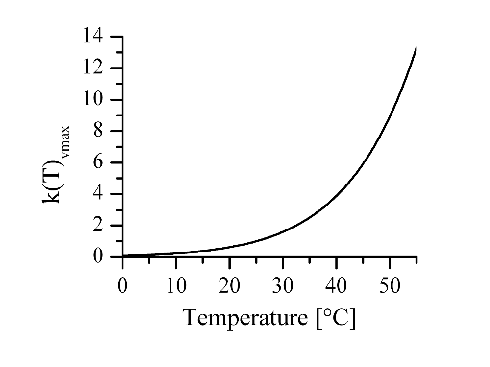
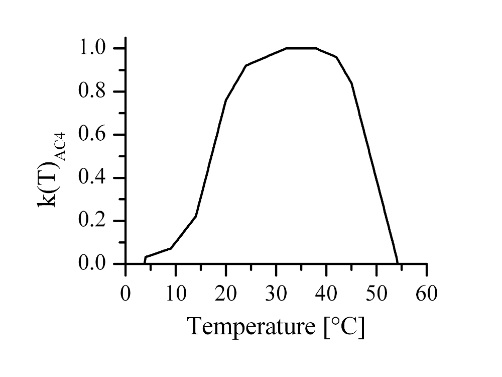

# Photosynthesis

Modelling of crop growth follows a generic approach used with the SUCROS model (van Keulen et al., 1982). Daily net dry matter production by photosynthesis and respiration is driven by radiation and temperature. Gross CO2 assimilation is calculated by estimating the sky cover duration:

$$A_g = O_r \cdot A_0 + (1-O_r) \cdot A_c$$

$A_g$ Gross CO2 assimilation rate $[kg\ , CO_2 \, ha^{-1} \, h^{-1}]$ 
$O_r$ Relative sky cover duration $[d \, d^{-1}]$ 
$A_0$ CO2 assimilation under clouded sky	$[kg\ , CO_2 \, ha^{-1} \, h^{-1}]$ 
$A_c$ CO2 assimilation under clear sky $[kg\ , CO_2 \, ha^{-1} \, h^{-1}]$ 

where

$$O_r = \frac{R_c - (0.5 \cdot R_s \cdot 10^9)} {0.8 \cdot R_c}$$

$O_r$ Relative sky cover duration $[d \, d^{-1}]$ 
$R_s$ Global radiation $[MJ \, m^2 \, d^{-1}]$ 
$R_c$ Irradiation under clear sky $[J \, m^2]$ 

Gross CO2 assimilation includes assimilation under clouded and under clear sky conditions:

$$A_c = \begin{cases}  PHCL & LAI < 5  \\ PHCH & LAI \geq 5 \end{cases}$$

$$A_O = \begin{cases}  PHOL & LAI < 5 \\ PHOH & LAI \geq 5 \end{cases}$$

$A_O$ CO2 assimilation under clouded sky	$[kg \, CO_2 \, ha^{-1} \, h^{-1}]$ 
$A_C$ CO2 assimilation under clear sky $[kg \, CO_2 \, ha^{-1} \, h^{-1}]$ 
$LAI$ Leaf area index $[m^2 \, m^{-2}]$ 

The following auxiliary algorithms were used:

$$PHCL = \begin{cases} PHC3 \cdot \left(  1-e^{\frac{PHC4}{PHC3}}  \right) & PHC3 < PHC4 \\ PHC4 \cdot \left(  1-e^{\frac{PHC3}{PHC4}}\right) & PHC3 \geq PHC4 \end{cases}$$

$$PHCH = 0.95 \cdot (PHCH1 + PHCH2) + 20.5$$

$$PHOL = \begin{cases} PHO3 \cdot \left(  1-e^{\frac{PHC4}{PHO3}}  \right) & PHO3 < PHC4 \\ PHC4 \cdot \left(  1-e^{\frac{PHO3}{PHC4}}\right) & PHO3 \geq PHC4 \end{cases}$$

$$PHOH = 0.9935 \cdot PHOH1 + 1.1$$

where

$$PHC3 = PHCH \cdot (1-e^{-0.8 \cdot LAI})$$

$$PHC4 = N_{atmo} \cdot LAI \cdot A$$

$N_{atmo}$ Atmospheric day length $[h]$ 
$LAI$ Leaf area index $[m^2 \, m^{-2}]$ 
$A$ CO2 assimilation rate $[kg \, CO_2 \, ha^{-1} \, h^{1}]$ 

$$PHO3 = PHOH \cdot (1-e{-0.8 \cdot LAI})$$

$$PHCH1 = h_p \cdot A \cdot N_{eff} \cdot \frac{X}{1+X}$$

$LAI$ Leaf area index $[m^2 \, m^{-2}]$ 
$h_p$ Sun’s culmination (vertical projection) $[^{\circ}]$ 
$A$	CO2 assimilation rate $[kg \, CO_2 \, ha^{-1} \, h^{1}]$ 
$N_{eff}$ Effective day length $[h]$ 

$$X = log \left( \frac{1+0.45 \cdot R_c} {N_{eff} \cdot 3600} \right)  \cdot \frac{\varepsilon_N}{h_p \cdot A}$$

$R_c$ Irradiation under clear sky $[J \, m^{-2}]$ 
$\varepsilon_N$	Net radiation use efficiency of CO2 assimilation	$[kg \, CO_2 \, ha^{-1} \, h^{1}]$ 
$N_{eff}$ Effective day length $[h]$ 
$h_p$ Sun’s culmination (vertical projection) $[^{\circ}]$ 
$A$	CO2 assimilation rate $[kg \, CO_2 \, ha^{-1} \, h^{1}]$ 

$$PHCH_2 = (5-h_p) \cdot A \cdot N_{eff} \cdot \frac{Y}{1+Y}$$

$h_p$ Sun’s culmination (vertical projection) $[^{\circ}]$ 
$A$ CO2 assimilation rate $[kg \, CO_2 \, ha^{-1} \, h^{-1}]$ 
$N_{eff}$ Effective day length $[h]$ 

$$Y=log \left(  \frac{1+0.55 \cdot R_c}{N_{eff} \cdot 3600} \right) \cdot \frac{\varepsilon_N}{(5-h_p) \cdot A}$$

$A$	CO2 assimilation rate $[kg \, CO_2 \, ha^{-1} \, h^{-1}]$ 
$\varepsilon_N$	Net radiation use efficiency of CO2 assimilation	$[kg \, CO_2 \, J^{-1} \, ha^{-1} \, h^{-1}]$ 
$R_c$ Irradiation under clear sky $[J \, m^{-2}]$ 
$h_p$ Sun’s culmination (vertical projection) $[^{\circ}]$ 

$$PHOH1 = 5 \cdot A \cdot \varepsilon_N \cdot \frac{Z}{1+Z}$$

$A$	CO2 assimilation rate $[kg \, CO_2 \, ha^{-1} \, h^{-1}]$ 
$\varepsilon_N$	Net radiation use efficiency of CO2 assimilation	$[kg \, CO_2 \, J^{-1} \, ha^{-1} \, h^{-1}]$ 

$$Z = \frac{R_0}{N_{eff} \cdot 3600} \cdot \frac{\varepsilon_N}{5\cdot A}$$

$Z$ 
$N_{eff}$ Effective day length $[h]$ 
$\varepsilon_N$	Net radiation use efficiency of CO2 assimilation	$[kg \, CO_2 \, J^{-1} \, ha^{-1} \, h^{-1}]$ 
$A$	CO2 assimilation rate $[kg \, CO_2 \, J^{-1} \, ha^{-1} \, h^{-1}]$ 

$$h_p = \sin(90 + \delta + \varphi) \cdot \left( \frac{\pi}{180}\right)$$

$h_p$ Sun’s culmination (vertical projection) $[rad]$ 
$\delta$ Solar declination $[^{\circ}]$ 
$\varphi$ Latitude $[^{\circ}]$ 

$$\varepsilon_N = (1-\alpha_c) \cdot \varepsilon_L$$

$\varepsilon_N$	Net radiation use efficiency of CO2 assimilation	$[kg \, CO_2 \, J^{-1} \, ha^{-1} \, h^{-1}]$ 
$\alpha_c$ Crop albedo 
$\varepsilon_L$	Radiation use efficiency of CO2 assimilation	$[kg \, CO_2 \, J^{-1} \, ha^{-1} \, h^{-1}]$ 

$$N_{atmo} = 12 \cdot \frac{ \left( \pi + 2 \cdot \arcsin \left( \frac{\delta_{sin}}{\delta{cos}} \right) \right)}{\pi}$$

$N_{atmo}$ Atmospheric day length $[h]$ 

$$N_{eff} = 12 \cdot \frac{\left(\pi + 2 \cdot \arcsin \left( \frac{(-\sin(\frac{8 \cdot \pi}{180}) + \delta{sin})}{\delta_{cos}}   \right)  \right)}{\pi}$$

$N_{eff}$ Effective day length $[h]$ 

$$N_{photo} = 12 \cdot \frac{\left(\pi + 2 \cdot \arcsin \left( \frac{(-\sin(\frac{-6 \cdot \pi}{180}) + \delta_{sin})} {\delta_{cos}} \right)\right)}{\pi}$$

$N_{photo}$ Photoperiodic day length $[h]$ 

$$R_c = 0.5 \cdot 1300 \cdot \bar{R}_{photo} \cdot e^{\frac{-0.14}{\bar{R}_{photo}}}$$

$R_c$	Irradiation under clear sky	$[J \, m^{-2}]$ 

$$R_o = 0.2 \cdot R_c$$

$R_o$ Irradiation under clouded sky	$[J \, m^{-2}]$ 

$$\bar{R}_{photo}  = 3600 \cdot \left(  \delta_{sin} \cdot N_{astro} + \frac{24}{\pi} \cdot \delta_{cos}  \cdot \sqrt{\left(1-\left(\frac{\delta_{sin}}{\delta_{cos}}\right)^2\right)} \,\,\,\right)$$

$\bar{R}_{photo}$ Mean photosynthetically active radiation $[J \, m^{-2}]$ 

CO2 has an impact on the crop’s photosynthesis rate and stomata resistance, which in turn influences transpiration (Nendel et al., 2009). Mitchell et al. (1995) presented a set of algorithms for the calculation of the maximum photosynthesis rate, based on ideas of Farquhar and von Caemmerer (1982) and Long (1991):

$$A =  \frac{( C_i - \Gamma^{*}) \cdot V_{c_{max}}}{C_i + K_c \cdot \left(  1 + \frac{O_i}{K_o} \right)}$$

$A$	CO2 assimilation rate $[kg \, CO_2 \, ha^{-1} \, d^{-1}]$ 
$C_i$ Inter-cellular CO2 concentration $[\mu mol \, mol^{-1}]$ 
$\Gamma^{*}$ Compensation point of photosynthesis, related to $C_i$ in absence of dark respiration $[\mu mol \, mol^{-1}]$ 
$O_i$ Inter-cellular O2 concentration $[\mu mol \, mol^{-1}]$ 
$V_{c_{max}}$ Maximum saturated Rubisco carboxylation rate $[\mu mol \, m^{-2} \, s^{-1}]$ 
$K_c$ Michaelis-Menten constant for CO2 $[\mu mol \, mol^{-1}]$ 
$K_o$ Michaelis-Menten constant for O2 $[\mu mol \, mol^{-1}]$ 

Temperature dependencies of $C_i$, $O_i$, $K_c$, $K_0$ and $V_{c_{max}}$ and its parameters were described by Long (1991). Accordingly, $C_i$ is calculated from atmospheric CO2 concentration $C_a$ as:

$$C_i = C_a \cdot 0.7 \cdot \frac{(1.674 - 6.1294 \cdot 10^{-2} \cdot T + 1.1688 \cdot 10^{-3} \cdot T^2 - 8.8741 \cdot 10^{-7} \cdot T^3 )}{0.73547}$$

$C_i$ Inter-cellular CO2 concentration $[\mu mol \, mol^{-1}]$ 
$T$	Daily mean air temperature in 2 m height $[^{\circ} C]$ 

Respectively, $O_i$ is calculated by:

$$O_i = 210 + \frac {( 0.047 - 1.3087 \cdot 10^{-4} \cdot T + 2.5603 \cdot 10^{-6} \cdot T^2 - 2.1441 \cdot 10^{-8} \cdot T^3 )}  {2.6934 \cdot 10^{-2}}$$

$O_i$ Inter-cellular O2 concentration $[\mu mol \, mol^{-1}]$ 
$T$ Daily mean air temperature in 2 m height $[^{\circ} C]$ 

The seasonal dynamic of the atmospheric CO2 concentration from 1958 until today is described using:

$$C_a = 222 + e ^{0.0119 \cdot (t_{dec} - 1580)} + 2.5 \cdot \sin \left( \frac{t_{dec} - 0.5} {0.1592} \right)$$

$C_a$ Atmospheric CO2 concentration $[\mu mol \, mol^{-1}]$ 
$t_{dec}$ Date in decimal form  

The algorithm used for light intensities below saturation which Mitchell et al. (1995) presented, was not applied. Instead, $A_{max}$ is adapted to light interception according to Goudriaan and van Laar (1978). Mitchell et al. (1995) proposed the following algorithm for the transition between photosynthetic quantum use efficiency and light-saturated photosynthesis:

$$\varepsilon_L = \frac{0.37 \cdot (C_i - \Gamma^{*})} {4.5 \cdot C_i + 10.5 \cdot \Gamma^{*}}$$

$\varepsilon_L$	Radiation use efficiency of CO2 assimilation	$[kg \, CO_2 \, J^{-1} \, ha^{-1} \, h^{-1}]$ 
$C_i$ Inter-cellular CO2 concentration $[\mu mol \, mol^{-1}]$ 
$\Gamma^{*}$ Compensation point of photosynthesis, related to $C_i$ in absence of dark respiration	$[\mu mol \, mol^{-1}]$ 

The compensation point of photosynthesis is obtained from:

$$\Gamma^{*} = \frac{0.5 \cdot 0.21 \cdot V_{c_{max}} \cdot O_i} {V_{c_{max}} \cdot K_o}$$

$C_i$ Inter-cellular CO2 concentration $[\mu mol \, mol^{-1}]$ 
$\Gamma^{*}$ Compensation point of photosynthesis, related to $C_i$ in absence of dark respiration $[\mu mol \, mol^{-1}]$ 
$V_{c_{max}}$ Maximum saturated Rubisco carboxylation rate $[\mu mol \, m^{-2} \, s^{-1}]$ 
$K_o$ Michaelis-Menten constant for O2 $[\mu mol \, mol^{-1}]$ 

The maximum saturated Rubisco carboxylation rate $V_{c_{max}}$ is calculated from:

$$V_{c_{max}} = 98 \cdot \frac{A_{max}} {34.668} \cdot k(T)_{v_{cmax}}$$

$V_{c_{max}}$ Maximum saturated Rubisco carboxylation rate $[\mu mol \, m^{-2} \, s^{-1}]$ 
$A_{max}$ Plant-specific maximum CO2 assimilation rate $[kg \, CO_2 \, ha^{-1} \, d^{-1}]$ 
$k(T)_{v_{cmax}}$ Temperature function for $V_{c_{max}}$ 

{ width="50%" }

*Figure 1: Temperature function for $V_{c_{max}}$ (Long, 1991).*

For crops using the C4 metabolism, no direct impact of the atmospheric CO2 concentration on photosynthesis is assumed. The crop-specific maximum CO2 assimilation rate is merely modified by a simple temperature function.

{ width="50%" }

*Figure 2: Temperature function for the CO2 assimilation rate of C4 crops (Sage & Kubien 2007).*

---

#### References

* Farquhar, G. D. & von Caemmerer, S. (1982). Modelling of photosynthetic response to environmental conditions. In: Encyclopedia of plant physiology. New series. Volume 12B. Physiological plant ecology. II. Water relations and carbon assimilation. (Eds O. L. Lange, P. S. Nobel, C. B. Osmond, & H. Ziegler), pp. 549-587. Berlin: Springer.

* Goudriaan, J. & van Laar, H. H. (1978). Relations between leaf resistance, CO2 concentration and CO2 assimilation in maize, beans, lalang grass and sunflower. Photosynthetica 12 (3), 241-249.

* Long, S. P. (1991). Modification of the response of photosynthetic productivity to rising temperature by atmospheric CO2 concentrations - Has its importance been underestimated. Plant Cell and Environment 14 (8), 729-739.

* Mitchell, R. A. C., Lawlor, D. W., Mitchell, V. J., Gibbard, C. L., White, E. M., & Porter, J. R. (1995). Effects of elevated CO2 concentration and increased temperature on winter-wheat - Test of ARCWHEAT1 simulation model. Plant Cell and Environment 18 (7), 736-748.

* Nendel, C., Kersebaum, K. C., Mirschel, W., Manderscheid, R., Weigel, H. J., & Wenkel, K.-O. (2009). Testing different CO2 response algorithms against a FACE crop rotation experiment. NJAS - Wageningen Journal of Life Sciences 57 (1), 17-25.

* Sage, R. F. & Kubien, D. S. (2007). The temperature response of C3 and C4 photosynthesis. Plant Cell and Environment 30 (9), 1086-1106.

* van Keulen, H., Penning de Vries, F. W. T., & Drees, E. M. (1982). A summary model for crop growth. In: Simulation of plant growth and crop production (Eds F. W. T. Penning de Vries & H. H. van Laar), pp. 87-97. Wageningen: PUDOC.