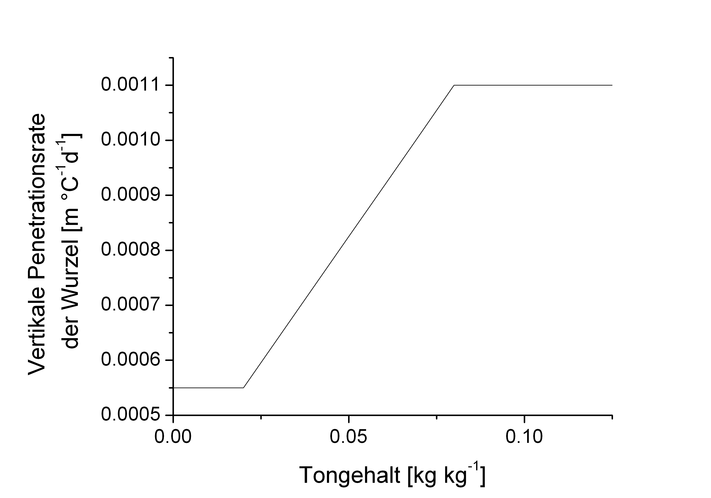

# Root growth

The simulation of root growth follows the concept proposed by Pedersen et al. (2010). Root dry mass is distributed over depth according to Gerwitz & Page (1974), with rooting depth increasing exponentially with the modified thermal time. The crop-specific maximum rooting depth is adjusted using the soil-specific maximum rooting depth, which is calculated from the soil sand content and bulk density:

$$R_{max} = \frac{R_{B_{max}} + 2 \cdot R_{p_{max}}}{3}$$

$R_{max}$ Maximum rooting depth	$[m]$ 
$R_{B_{max}}$ Crop-specific maximum rooting depth $[m]$ 
$R_{p_{max}}$ Soil-specific maximum rooting depth $[m]$ 

and

$$R_{B_{max}} = f_s \cdot \left (   \frac{ ( 1.1-f_s) } {0.275} \right ) \cdot \left ( \frac{1.4}{\rho_B} + \frac{\rho^2_B}{40}  \right)$$

$R_{B_{max}}$ Soil-specific maximum rooting depth $[m]$ 
$f_s$ Soil sand content	$[kg \, kg^{-1}]$ 
$\rho_B$ Soil bulk density	$[kg \, m^{-3}]$ 

whereas the influence of sand content is limited for values below 0.55 kg kg-1.

The crop-specific root penetration rate into deeper soil layers is reduced at low clay contents.

{ width="50%" }

*Figure 1: Vertical penetration rate of winter wheat roots in relation to soil clay content.*

The thermal time for root growth is calculated based on a minimum temperature that limits root development:

$$DD_{root} = T_{av} - T_{r\,min}$$

$DD_{root}$	Thermal time for root growth $[^{\circ}C \, d]$ 
$T_{av}$ Mean daily air temperature $[^{\circ}C]$ 
$T_{r\,min}$ Minimum temperature for root growth $[^{\circ}C]$ 

The daily thermal increment is limited to 20°C.

Accordingly, the rooting depth is calculated as:

$$R_z = R_{ini} + (DD_{root} - DD_{lag} ) \cdot k_{rz}$

$$R_z$ Current rooting depth $[m]$ 
$R_{ini}$ Rooting depth at sowing $[m]$ 
$DD_{root}$	Thermal time for root growth $[^{\circ}C \, d]$ 
$DD_{lag}$ Delay in root initiation $[^{\circ}C \, d]$ 

The root length in the respective soil layer is then calculated from:

$$L_{root} = W_{root} \cdot l_r$$

$L_{root}$ Total root length $[m \, m^{-2}]$ 
$W_{root}$ Biomass in the root compartment $[kg \, m^{-2}]$ 
$l_r$ Crop-specific root length $[m \, kg^{-1}]$ 

The distribution factor for root density in each soil layer is calculated as:

$$\lambda_z = \begin{cases}   \lambda_0 e^{-a_z\cdot z} & z < R_z \\ \lambda_0 e^{-a_z \cdot z} \cdot \left ( 1- \frac{z-R_z}{q \cdot R_z - R_z }  \right ) & q \cdot R_z < z < R_z  \\ 0 & z > q \cdot R_z  \end{cases}$$

$\lambda_z$	Distribution factor of root length density at depth $z$ $[m \, m^{-3}]$ 
$\lambda_0$	Distribution factor of root length density at depth 0	$[kg \, m^{-3}]$ 
$a_z$ Shape factor 
$z$	Depth $[m]$ 
$R_z$ Rooting depth	$[m]$ 
$q$	Ratio of absolute to simulated rooting depth 

Using factors normalized to the range [0;1], the root length density in each soil layer is calculated as:

$$\Lambda_z = \frac{\lambda_z}{\sum^{z_{max}}_{z=1} \lambda_z} \cdot L_{root}$$

$\Lambda_z$ Root length density at depth $z$	$[m \, m^{-3}]$ 
$\lambda_z$ Distribution factor of root length density at depth $z$ $[m \, m^{-3}]$ 
$z_{max}$ Maximum profile depth $[m]$ 
$L_{root}$ Total root length $[m \, m^{-2}]$ 

Finally, the root diameter is assumed to decrease from crops with above-ground storage organs (cereals, maize, rapeseed, etc.) and to remain constant for crops with below-ground storage organs (sugar beet, potato, carrot, etc.):

{ width="50%" }

*Figure 2: Root diameter in relation to soil depth for crops with above-ground (‑‑‑) and below-ground (—) storage organs.*

---

#### Reference

* Gerwitz, A., Page, E.R. (1974): An empirical mathematical model to describe plant root systems. J. Apl. Ecol. 11, 773-781.

* Pedersen, A., Zhang, K.F., Thorup-Kristensen, K., Jensen, L.S. (2010): Modelling diverse root density dynamics and deep nitrogen uptake - A simple approach. Plant Soil 326 (1-2), 493-510.

 