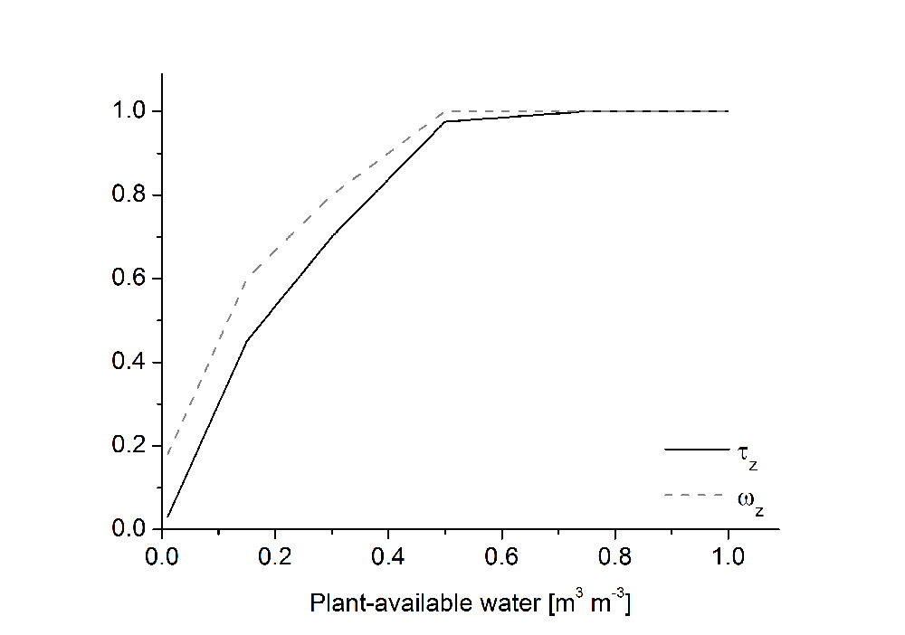

# Transpiration

Reference evapotranspiration $ET0$ is calculated using the Penman-Monteith method, according to Allen et al. (1998). This method requires the diurnal minimum and maximum temperature, the water vapour pressure deficit, wind velocity, and total global radiation.

$$ET_0 = \frac{0.408 \cdot \Delta \cdot (R_n - G) + \gamma \cdot \frac{900}{\gamma + 273} \cdot u_2 \cdot (e_s - e_a) } {\Delta + \gamma \cdot (1+\frac{r_a}{r_s})}$$

$\Delta$ Slope of the vapour pressure curve $[kPa\,K^{-1}]$ 
$R_n$ Net radiation at the crop surface	$[MJ\, m^{-2} \, d^{-1}]$ 
$G$	Soil heat flux density $[MJ\, m^{-2} \, d^{-1}]$ 
$T$	Mean daily air temperature at 2 m height $[^{\circ} C]$ 
$u_2$ Wind speed at 2 m height $[m \, s^{-1}]$ 
$e_s$ Saturation vapour pressure $[kPa]$ 
$e_a$ Actual vapour pressure $[kPa]$ 
$\gamma$ Psychrometric constant	$[kPa \, K^{-1}]$ 
$r_a$ Atmospheric resistance $[s\, m^{-1}]$ 
$r_s$ Surface resistance $[s\, m^{-1}]$ 
 
where

$$\gamma = 6.65 \cdot 10^{-4} \cdot P$$

The surface resistance for the reference evapotranspiration assumes a 12 cm cut grass crop and is calculated using:

$$r_s = \frac {r_1} {1.44}$$

$r_1$ Stomata resistance; 100 s m–1	$[s \, m^{-1}]$

The leaf area index $LAI$ and crop height $h$ are considered for the surface resistance of the actual crop:

$$r_s = \frac{r_1}{LAI \cdot h_c}$$

$r_s$ Surface resistance $[s \, m^{-1}]$ 
$r_1$ Stomata resistance $[s \, m^{-1}]$ 
$LAI$ Leaf area index $[m^2 \, m^{-2}]$ 
$h_c$ Crop height $[m]$ 
 
The crop height is calculated using:

$$H_c = \frac{h_{c\,max}}{1+ e^{-a \cdot (DD_{relh}-b)}}$$

$h_{c\,max}$ Crop-specific maximum height $[m]$ 
$a, b$ Crop-specific parameter 
$DD_{relh}$	Relative crop development for height 
 
where

$$DD_{relh} = \frac{DD_{acth}} {DD_{croph}}$$

$DD_{acth}$ Actual temperature sum from emergence $[^{\circ}C \, d]$ 
$DD_{croph}$ Crop-specific total temperature sum up to maximum height $[^{\circ}C \, d]$ 
 
Specific leaf weights to calculate $LAI$ from the leaf biomass are given for each development stage and adjusted linearly to the relative phenological development.

---

The stomata resistance of the actual crop is calculated according to a suggestion of Yu et al. (2001):

$$r_1  = \frac{C_s(1+\frac{e_a}{e_s}) } {a \cdot A_g}$$

$r_1$ Stomata resistance $[s^{-1}]$ 
$C_s$ CO2 concentration outside the leaf (= $C_a$)	$[\mu mol \, mol^{-1}]$ 
$A_g$ Gross CO2 assimilation rate $[kg \, CO_2 \, ha^{-1} \, d^{-1}]$ 
$e_a$ Actual air vapour pressure $[Pa]$ 
$e_s$ Saturation air vapour pressure $[Pa]$ 
 
In a rough simplification, $C_s$ is considered equal to the atmospheric CO2 concentration $C_a$. Its seasonal dynamic from 1958 up until today is described using:

$$C_a = 222 + e^{ 0.0119 \cdot (t_{dec} - 1580) } + 2.5 \cdot \left(   \frac{t_{dec} - 0.5} {0.1592} \right)$$

$C_a$ Atmospheric CO2 concentration $[\mu mol \, mol^{-1}]$ 
$t_{dec}$ Decimal date 
 
Additionally, this function carries forward the atmospheric CO2 concentration until 2100, similar to the assumption made in the IPCC A1B scenario (IPCC, 2007).

---

Crop-specific potential evapotranspiration is calculated using also crop-specific factors ($K_c$) during the crop’s growth period, and a factor for bare soil between harvest and emergence of the subsequent crop. The $K_c$ factors are coupled to the crop’s developmental stages.

$$ET_p = ET_0 \cdot K_c - I$$

$ET_p$ Potential evapotranspiration	$[mm]$ 
$ET_0$ Reference evapotranspiration	$[mm]$ 
$K_c$ ncrop-specific factor 
$I$	Evaporation from interception storage $[mm]$ 
 
To what extent transpiration contributes to total evapotranspiration is determined by the ground coverage:

$$T_p = ET_p \cdot \beta$$

$T_p$ Potential transpiration $[mm]$ 
$ET_p$ Potential evapotranspiration	$[mm]$ 
$\beta$	Ground coverage 

---

Transpiration is calculated layer-wise for water uptake from the respective layer, considering root distribution, efficiency, and possible oxygen deficit.

$$T_z = T_p \cdot \frac {\omega_z \cdot \Lambda_z}   {\sum^{z_{max}}_{i=1} \omega_i \cdot \Lambda_j} \cdot \zeta_o$$

$T_z$ Actual transpiration in layer $z$	$[mm]$ 
$T_p$ Potential transpiration $[mm]$ 
$\omega_z$ Root water uptake efficiency in layer $z$ (Fig. 1) 
$\Lambda_z$	Root length density in layer $z$ $[m \, m^{-3}]$ 
$\zeta_o$ Stress factor oxygen deficit 
 
{ width="50%" }

*Figure 1: Reduction function for transpiration ($\tau_z$) and for root water uptake efficiency ($\omega_z$) in dependency of water availability in the respective soil layer.*

Given sufficient amounts of available water, it is removed from the soil layers according to the layer-wise calculated transpiration, from the soil surface downwards. A potential transpiration deficit is calculated for every layer:

$$\zeta_{Wpot} = \left(  \frac{T_z}{d\cdot 1000} - (\theta - \theta_{PWP} ) \right) \cdot \Delta z \cdot 1000$$

$\zeta_{Wpot}$ Potential transpiration deficit in layer $z$	$[mm]$ 
$T_z$ Actual transpiration in layer $z$	$[mm]$ 
$\Delta z$ Depth of soil layer $[m]$ 
$\theta$ Water content in soil layer $[m^3\, m^{-3}]$ 
$\theta_{PWP}$ Soil water content at permanent wilting point $[m^3\, m^{-3}]$ 
 
At decreasing water contents water conductivity in the soil is reduced. The resulting reduction of transpiration in the soil layer is calculated as:

$$T_{red} = T_z \cdot (1-\tau_z)$$

$T_{red}$ Reduced transpiration in layer $z$ $[mm]$ 
$T_z$ Actual transpiration in layer $z$ $[mm]$ 
$\tau_z$ Reduction factor water availability (Fig.) 
 
The actual transpiration deficit of the respective layer is calculated from the larger of both values. It will be used to update actual transpiration.

$$\zeta_{Wact} = max(\zeta_{Wpot}, T_{red})$$

$\zeta_{Wact}$ Actual transpiration deficit in layer $z$ $[mm]$ 
$\zeta_{Wpot}$ Potential transpiration deficit in layer $z$	$[mm]$ 
$T_{red}$ Reduced transpiration in layer $z$ $[mm]$ 
 
The total actual transpiration of the crop adds up from the actual transpiration of the layers:

$$T_a = \sum^{z_{max}}_{z=1} T_z$$

$T_a$ Actual transpiration $[mm]$ 
$T_z$ Actual transpiration in layer $z$ $[mm]$ 
$z$	Layer number 
$z_{max}$ Lowest layer in soil profile 
 
Crop growth is limited by water availability. Drought stress is indicated by the relation of actual to potential transpiration (Kersebaum, 1995).