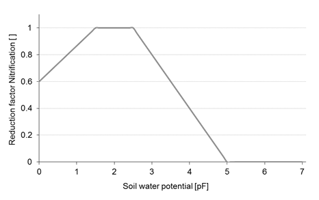
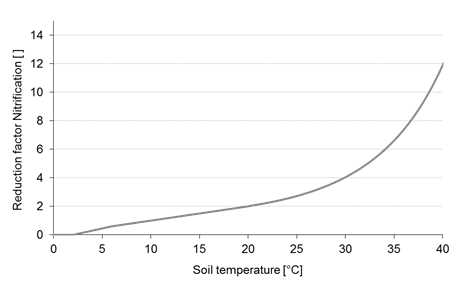
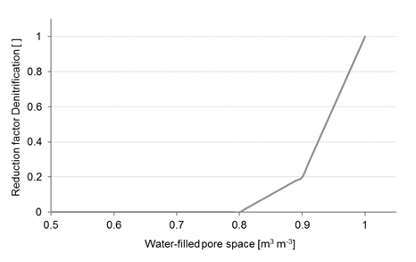

# Nitrification and Denitrification

The turn-over processes of ammonium to nitrate (nitrification) and of nitrate to dinitrogen (denitrification) are described as:

$$N = K_{NO} \cdot c_{NH^+_4} \cdot f_N(T) \cdot f_N(\theta)$$

$N$	Nitrification rate	$[kg \, N \, m^{-3} \, d^{-1}]$ 
$K_{NO}$ Nitrification rate coefficient at standard conditions $[d^{-1}]$ 
$c_{NH_4^+}$ $NH_4^+$ concentration in soil	$[kg \, N \, m^{-3}]$ 
$f_N(T)$ Reduction factor temperature (Fig. 2) 
$f_N(\theta)$ Reduction factor soil moisture (Fig. 3)	 

*Figure 1: $f_N(\theta)$ – Reduction factor for nitrification in dependence of the soil water potential (Abrahamsen and Hansen, 2000).*

*Figure 2: Reduction factor for nitrification ($f_N(T)$) and denitrification ($f_D(T)$) in dependence of soil temperature (Abrahamsen and Hansen, 2000).*

$$D_{pot} = K_{DO} \cdot \Phi_{CO_2} \cdot f_D(T)$$

$D_{pot}$ Potential denitrification rate $[kg \, N \, m^{-3} \, d^{-1}]$ 
$K_{DO}$ Anaerobic denitrification rate	$[kg \, N \, m^{-3} \, d^{-1}]$ 
$\Phi_{CO_2}$ Microbial CO2 release rate	$[kg \, C \, d^{-1}]$ 
$f_D(T)$ Reduction factor temperature (Fig. 2) 

*Figure 3: $f_D(\theta)$ – Reduction factor for denitrification in dependence of water-filled pore space in soil (Abrahamsen and Hansen, 2000).*

$$D_{act} = min \begin{cases} D_{pot} f_D(\theta) \\ V_{NO_3} \cdot C_{NO_3}  \end{cases}$$

$D_{act}$	Actual denitrification rate	$[kg \, N \, m^{-3} \, d^{-1}]$ 
$D_{pot}$	Potential denitrification rate $[kg \, N \, m^{-3} \, d^{-1}]$ 
$f_D(\theta)$ Reduction factor soil moisture (Fig. 3) $[d^{-1}]$ 
$V_{NO_3}$ Transport rate $NO_3^-$ $[kg \, N \, m^{-3}]$ 
$C_{NO_3}$ Soil $NO_3^-$ concentration  

#### References

* Abrahamsen, P., Hansen, S., 2000. Daisy: an open soil-crop-atmosphere system model. Environ. Mod. Software 15, 313-330.