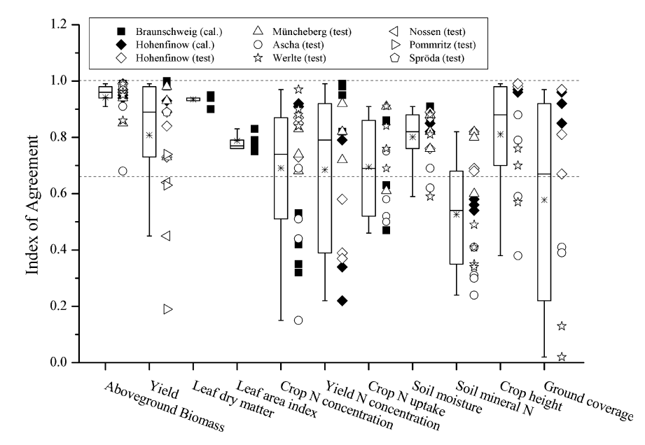
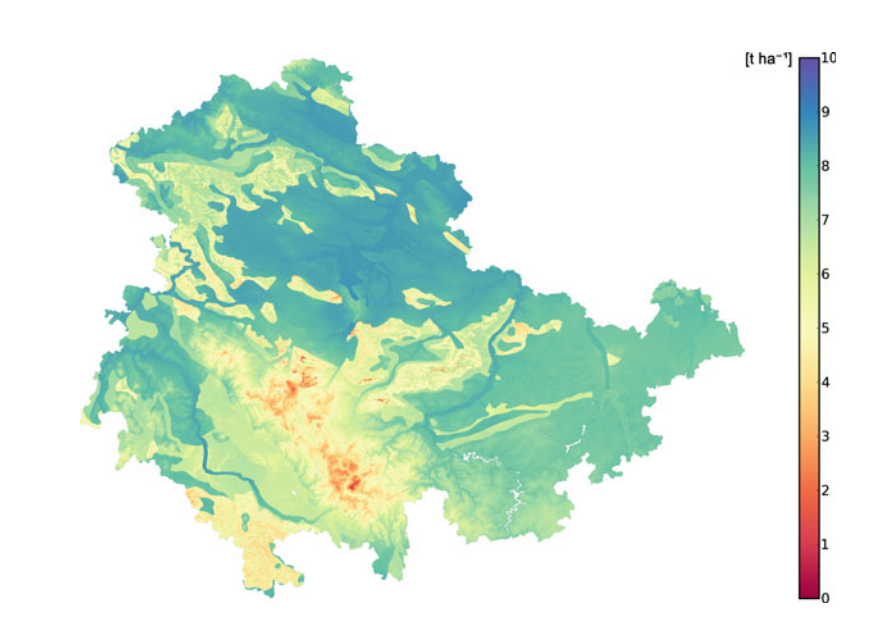
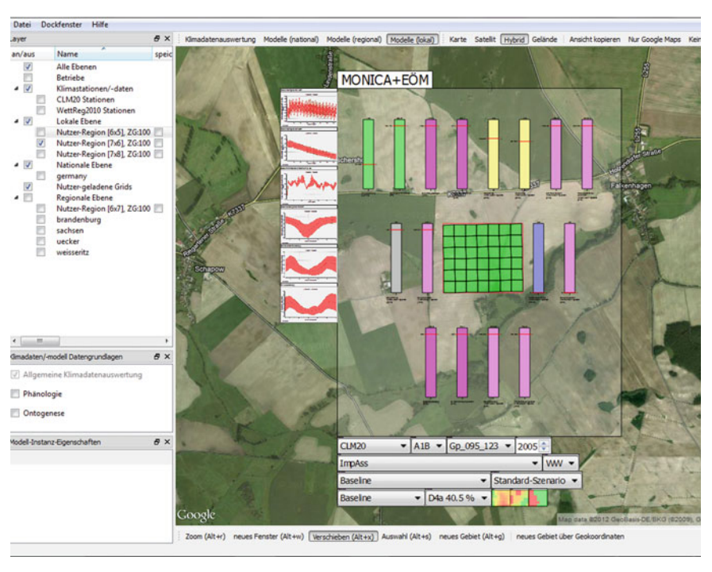
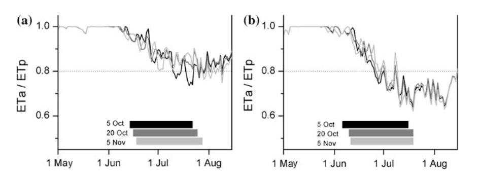

## Overview and Applications of MONICA

The MONICA program is built on the foundation of the HERMES model, which was first used to assess nitrogen leaching and, 
as a result of this leaching, its adverse effects on groundwater due to agriculture. As part of MONICA's suite of capabilities, 
functions that model the effect of increased concentrations of atmospheric CO₂ and climatic temperature stress on crop development 
have been integrated into the assessors' tool to evaluate the effect of climate change on crop production.
---

### Calibration and Validation

MONICA has been developed using data from an experimental crop rotation experiment conducted in an elevated CO₂ atmosphere and under nitrogen fertiliser regimes ranging from low to high. 
The crops that were rotated represent those typically grown throughout Central Europe are:

- Winter wheat
- Winter barley
- Sugar beet
- Maize

The model was subsequently validated against similar crop rotations from multiple locations
across Germany. Evaluation covered a broad range of output variables, including:

- Aboveground biomass and crop yield
- Leaf dry matter and leaf area index
- Crop nitrogen concentration and uptake
- Soil moisture and soil mineral nitrogen content
- Crop height and ground coverag

Assessment of model performance was evaluated by using Willmott’s Index of Agreement (d) Meter, 
and with calibrated runs generally producing values in the acceptable range for most variables and sites. Calibration was also extended to more crops, such as:

- Sorghum, Sudan grass, ryegrass
- Phacelia, oil radish, triticale
- Oat and field pea

*Figure 1: Overview of results for MONICA simulations of experimental crop rotations at various
sites across Germany. Willmott's Index of Agreement (d, Willmott and Wicks, 1980) for different
soil and crop variables from calibrated (closed symbols) and uncalibrated (open symbols) model
runs. The dotted lines indicate the acceptable value range for d (Nendel et al., 2011).*

---

### Applications in Research and Practice

MONICA has been applied in a broad range of research contexts and practical use cases.

#### Climate and Land Use Impact Assessment

MONICA has been utilized to simulate maize, soybean, sunflower, cotton and sugarcane yields for the Mato Grosso region of Brazil, under various environmental and land-use conditions. The results generated by MONICA have been incorporated into analytical models to simulate the behaviour of farmers and land cover changes in addition to providing feedback into regional climate models.

#### Greenhouse Gas Emissions and Soil Carbon

In addition to examining the interactions between climate and land-use changes, MONICA also supports projections of the impact of combined changes on soil greenhouse gas emissions, as well as long-term development of soil carbon stocks. This capability can be used to identify management approaches that promote carbon sequestration and improve soil health.

#### Multi-Model Ensemble Studies

MONICA has contributed to several international multi-model ensemble projects, including:

- Simulations of spring barley yields under uncalibrated conditions across Europe
- Simulations of winter wheat growth at multiple sites worldwide

Ensemble studies performed using MONICA have also been useful for quantifying the uncertainty of crop models in projecting climate change impacts on global food security while demonstrating MONICA's capability to reliably function across a wide range of climate and soil types.

#### High-Resolution Spatial Applications

MONICA has recently been used to verify the performance of spatially-resolved weather datasets for use in regional yield simulations. In one of these studies, a 48-processor computer cluster was used to generate about 1.6 million data points at a spacing of 100×100 m. This analysis revealed several systematic biases that will need to be adjusted when using a point-scale model like MONICA in larger scale environments.

*Figure 2: 100 × 100 m MONICA simulations of average winter wheat yields for the years
1992–2010 in Thuringia, Germany (Nendel et al., 2013).*

---

### Decision Support Integration

MONICA is integrated into the **LandCaRe Decision Support System (DSS)** and available for simulations at the plot level. 
When used in conjunction with a farm-based economic coefficient generator, the outputs of MONICA allow for the translation of 
agronomic results into economic terms (costs and returns), thus making results easier for stakeholders to interpret, 
since many find it easier to interpret financial indicators versus just agronomic ones.

Within the DSS, users are able to conduct comparison simulations across different input parameters 
(e.g., weather, crop rotation, soil type, and management practices), providing better insight into how agricultural systems may respond under variable conditions. 
In addition to directly providing scenario analysis, the DSS also supports incidental learning about agro-ecosystem behaviour.

The primary function of MONICA, therefore, in this context is to provide rigorous responses to *what if* 
questions related to the potential impact of climate change on productivity of agricultural production.

*Figure 3: User interface of the LandCaRe Decision Support System with MONICA plot-scale
simulation results displayed in a result panel. Zooming into the panel reveals more details
of the simulation results.*

*Figure 4: User interface of the LandCaRe Decision Support System with MONICA plot-scale
simulation results displayed in a result panel. Zooming into the panel reveals more details
of the simulation results.*
