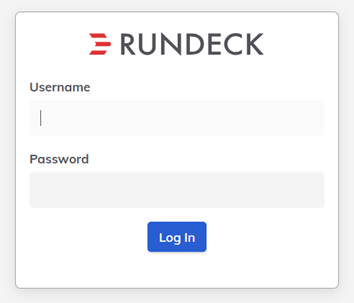
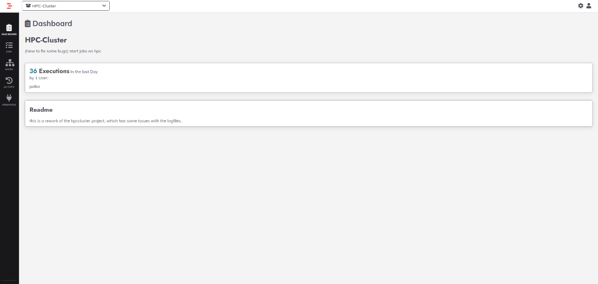
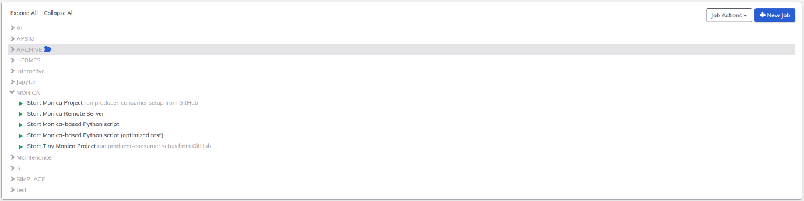
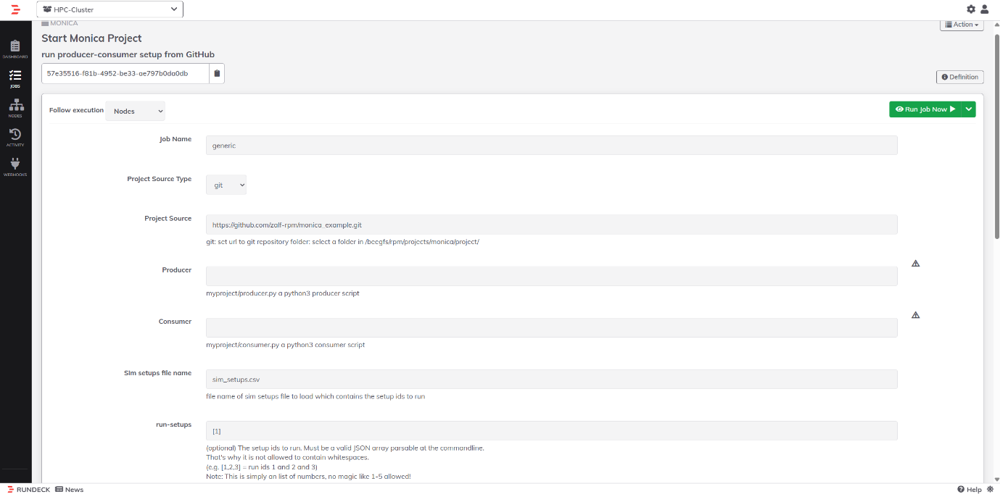
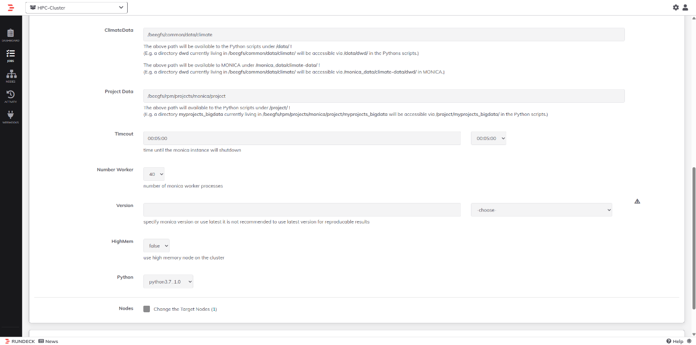

# Running MONICA via Rundeck (ZALF MONICA Users)

## Overview

MONICA users at ZALF who need to perform computationally intensive or large-scale simulations can run MONICA on the HPC cluster.
To simplify cluster access and standardize simulation workflows, the Model and Simulation Infrastructure working group provides a web-based interface called **Rundeck**: 

[Rundeck Web Interface](https://www.zalf.de/en/struktur/CDP/Pages/Arbeitsgruppen.aspx#x71x)

Rundeck acts as a frontend between the user and the HPC system. Instead of submitting jobs manually via the command line, users configure and start MONICA simulations through predefined Rundeck jobs. These jobs automatically:

- Set up the computing environment  
- Distribute simulation tasks  
- Execute simulations using a producer–consumer setup

---

## How to Run MONICA Using Rundeck

This section provides a step-by-step guide to starting a MONICA simulation on the HPC cluster using Rundeck.

### Step 1: Log in to Rundeck

1. Open the Rundeck web interface in your browser:  
   [Rundeck Web Interface](https://mas-service.zalf.de/rundeck)

2. Log in using your HPC credentials:

     - Username  
     - Password  
     - Yubikey (2-factor authentication)

3. Under **Projects**, select **HPC-Cluster**.

### Step 2: Navigate to the MONICA jobs

1. In the left-hand menu, click **Jobs**.

2. Go to the **MONICA** job folder.

3.	You will see several MONICA-related jobs. The most relevant ones are:

    - Start Monica Project (multi-node)
    - Start Tiny Monica Project (single node)

### Step 3: Open the MONICA job

1. Click on Start Monica Project or Start Tiny Monica Project.

2. The job configuration form will open.

3. All parameters required to start the MONICA simulation are specified on this page.

### Step 4: Configure the project source

**Project Source Type**

  - **git**: clone a repository for this run

    o	If selected, provide the repository URL. Example: [Rundeck Web Interface](https://github.com/zalf-rpm/monica_example.git)
	
  - **folder**: use an existing folder on the cluster

    o	If selected, provide an absolute path on BeeGFS

### Step 5: Specify producer and consumer scripts

**Producer**

  - Path (relative to the project root) of the producer script. Example: `myproject/producer.py`

**Consumer**

 - Path (relative to the project root) of the consumer script. Example: `myproject/consumer.py`

### Step 6:	Select simulation setups

**Sim setups file name**

 - Name of the CSV file containing the simulation setup definitions: `Example: sim_setups.csv`

**run-setups**

 - JSON array of setups IDs to run. Examples: [1] will run setup ID 1 and [1,2,3] will run setup IDs 1, 2, and 3. The value must not contain spaces.

### Step 7: Configure data paths

 **Climate data**

 - Specify the path to the climate directory on BeeGFS.
 - If the climate path is already handled inside your producer script, this field does not need to be changed.

**Project Data**

- 	Specify the path to your project data directory on BeeGFS. 
-	If the project data path is already handled inside your producer script, this field does not need to be changed.

### Step 8: Configure runtime parameters

**Timeout**

-  Specify the expected runtime of your simulation.
-  You can either enter a value manually or select one from the dropdown menu.

**Number Worker**

-	Total number of MONICA worker processes
-	For large simulations, increase this value to distribute the workload.
-	For Start Monica Project, workers are distributed across multiple nodes.
-	For Start Tiny Monica Project, all workers run on a single node.

**HighMem** 

-	Set to true to run on high-memory nodes.
-	Set to false to use standard compute nodes.

### Step 9: Select MONICA and Python versions

**Version** 
-	Choose the MONICA version from the dropdown menu.
-	It is strongly recommended to select a specific version to ensure reproducible results.

**Python**

-	Select the Python environment used for the producer and consumer scripts from the dropdown menu.
-	It is recommended to select:  python3.10_3

### Step 10: Start the Job

-	Review all parameters carefully.
-   Click Run Job Now.
-   Rundeck will start the job and redirect you to the execution output page.

### Step 11: Retrieve Simulations Results

Simulation outputs are written to: 
`/beegfs/rpm/projects/monica/out/<USER>_<JOB_EXEC_ID>_<DATE>/`

You can use tools such as WinSCP to access and download your simulation results from the HPC system.

