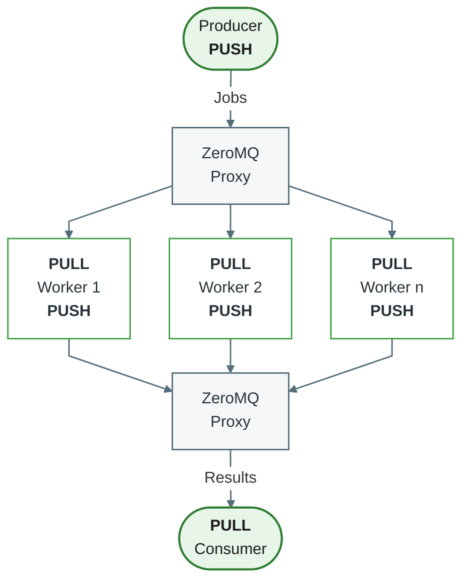
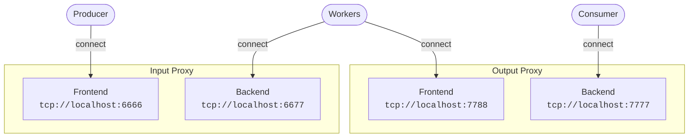

# Understanding the MONICA Server

## ZeroMQ

[ZeroMQ](https://zeromq.org/) is a messaging library available for many platforms and programming languages. It provides message-based communication between processes and programs.

MONICA uses ZeroMQ to exchange JSON messages. A simulation request is an `Env` JSON object containing the information required to run a simulation, including:

- climate data or climate CSV files paths
- soil parameters
- crop parameters
- simulation configuration
- requested output events

Climate data can be supplied directly in the message. Alternatively, the MONICA server can load climate data from a CSV string or from one or more CSV file paths.

The `monica-zmq-server` process normally behaves as a stateless worker: 

1. receive one simulation request
2. runs the simulation
3. return the result
4. wait for the next request

The result is also encoded as JSON. It contains the outputs requested through the simulation configuration, especially `sim.output.events`. Results can additionally contain warnings, errors, and custom identifiers.

ZeroMQ messages may also be used for control messages, such as `finish` message used to stop a server.

### Addresses and socket roles

ZeroMQ addresses use the following form:

```
transport://host:port
```

For example:

```
tcp://my-domain.example:6666
```

This means that TCP is used to connect to port `6666` on `my-domain.example`.

A process the provides an endpoint usually uses `bind`:

```
tcp://*:6666
```

The `*` means that the process binds to all available network interfaces. A client or worker normally uses `connect` with a concrete hostname or IP address:

```
tcp://localhost:6666
```

`tcp://*:<port>` is a bind address and must not be used as a connect address.

The communicating processes must agree on both:

- the address and transport
- compatible ZeroMQ socket patterns, such as `REQ/REP` or `PUSH/PULL`

A ZeroMQ connection may be established before either side is running. ZeroMQ queues messages while the connection is being established, subject to the normal socket and queue limitations.

---

### Pipeline mode

In pipeline mode, a producer sends jobs to one or more workers, and workers send results to one or more consumers.

The following diagram shows the PULL/PUSH pipeline configuration:



The diagram uses PULL/PUSH sockets. Start the proxy with `-pps` or `--pull-push-sockets` when using this topology. The proxy's default socket configuration is ROUTER/DEALER and requires compatible clients.

The input proxy distributes jobs among connected MONICA workers. Each worker runs one simulation at a time and sends its result to the output proxy. The output proxy forwards results to the consumer.

This architecture makes it possible to run multiple MONICA workers in parallel. Multiple producers can send jobs through the input proxy. Multiple consumers can receive results through the output proxy, although aggregation is often easier with a single consumer.

The producer can become a bottleneck if it must construct all simulation environments in one process. This can be addressed by using multiple producers or by moving part of the preparation work elsewhere.

---

## Running single server in request-reply mode

The simplest server configuration uses ZeroMQ request-reply messaging.

Start the server with its default address:

```
C:\> monica-zmq-server -s
```

The server binds a `REP` socket to:

```
tcp://*:6666
```

A client must connect to the server using a compatible `REQ` socket:

```
tcp://localhost:6666
```

The client sends one JSON request and waits for the corresponding JSON response.

A different address can be supplied with `-s` or `--serve-address`:

```
C:\> monica-zmq-server -s tcp://*:5555
```

The server now binds to port `5555`.

---

## Running a single server in pipeline mode

Pipeline mode uses separate sockets for receiving jobs and sending results.

To make MONICA bind both endpoints:

```
C:\> monica-zmq-server -bi -i tcp://*:6666 -bo -o tcp://*:7777
```

The options mean:

- `-bi`: bind the input socket
- `-i`: input address
- `-bo`: bind the output socket
- `-o`: output address

The input socket uses a `PULL` socket and receives jobs. The output socket uses a `PUSH` socket and sends results.

A producer can connect to the input endpoint:

```
tcp://localhost:6666
```

A consumer can connect to the output endpoint:

```
tcp://localhost:7777
```

---

## Connecting the server to externally bound endpoints

A MONICA worker can instead connect to endpoints bound by other processes:

```
C:\> monica-zmq-server -ci -i tcp://*:5555 -co -o tcp://*:5556
```

The options mean:

- `-ci`: connect the input socket
- `-i`: input address
- `-co`: connect the output socket
- `-o`: output address

In this configuration, another process must bind the endpoints, for example:

```
tcp://*:5555
tcp://*:5556
```

The MONICA processes must connect using a concrete address such as:

```
tcp://localhost:5555
tcp://localhost:5556
```

Do not use `tcp://*:<port>` with `-ci` or `-co`. Wildcard addresses are for binding only.

---

## Running multiple servers with ZeroMQ proxies

For larger workloads, multiple MONICA workers can be connected through two ZeroMQ proxies:

- an input proxy distributes jobs to workers
- an output proxy collects worker results and forwards them to consumers

The following example uses PULL/PUSH sockets.

Start the input proxy:

```
C:\> monica-zmq-proxy -pps -f 6666 -b 6677
```

Start the output proxy:

```
C:\> monica-zmq-proxy -pps -f 7788 -b 7777
```

The options are:

- `-pps`: use PULL/PUSH sockets
- `-f`: frontend port
- `-b`: backend port

The resulting topology is:



Start each MONICA worker with:

```
C:\> monica-zmq-server -ci -i tcp://localhost:6677 -co -o tcp://localhost:7788
```

The producer connects to port `6666` and sends jobs. The workers connect to port `6677`, process the jobs, and send results to port `7788`. The consumer connects to port `7777` and receives the results.

The proxies bind their frontend and backend ports, while producers, consumers, and MONICA workers connect to them. This allows the proxy processes and worker pool to remain running while producers and consumers are started or restarted independently.

The proxy executable defaults to ROUTER/DEALER sockets. When using the PULL/PUSH topology shown above, start it with `-pps`. The older `-p` option is retained for compatibility but is deprecated.

---

## Running multiple servers with Docker

The repository includes a Docker-based setup that starts:

- an input proxy
- an output proxy
- a configurable number of MONICA worker processes

The number of workers can be configured through the `monica_instances` environment variable. 

The default Docker configuration starts three workers. The default container ports are:

| Purpose                      | Port   |
|------------------------------|--------|
| Producer-facing input proxy  | `6666` |
| Worker-facing input proxy    | `6677` |
| Consumer-facing output proxy | `7777` |

The Docker workers connect to the internal proxy addresses, while producers and consumers connect to the externally exposed producer and consumer ports.

Refer to the repository's Docker configuration for the current image, environment variables, startup command, and port mappings.

For additional details, see the [ZeroMQ documentation](https://zguide.zeromq.org/).