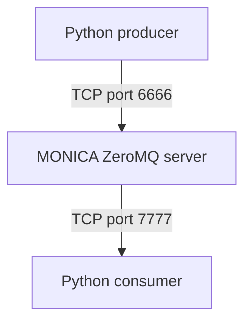

# Running MONICA with the Python producer-consumer pipeline

MONICA can be run through a Python producer-consumer workflow using ZeroMQ.

This setup is useful when simulation jobs are submitted programmatically and results are collected automatically.

The example configuration is located in: [installer/Hohenfinow2/python/](https://github.com/zalf-rpm/monica/tree/master/installer/Hohenfinow2/python)

---

## 1. Prerequisites

The following components are required:

- a built MONICA installation containing `monica-zmq-server`
- Python
- `pyzmq`
- the `zalfmas_common` Python package
- the MONICA parameter directory
- the Hohenfinow2 example input files

The example uses:

```
installer/Hohenfinow2/
├── climate-min.csv
├── crop-min.json
├── site-min.json
├── sim-min.json
└── python/
```

The JSON files may reference files from the MONICA parameter directory.

---

## 2. Configure the MONICA parameter path

From the [installer/Hohenfinow2/python/](https://github.com/zalf-rpm/monica/tree/master/installer/Hohenfinow2/python) directory, set the `MONICA_PARAMETERS` environment variable.

On Windows:

```cmd
set MONICA_PARAMETERS=..\..\monica-parameters
```

Adjust the path if the parameter directory is located elsewhere.

---

## 3. Start MONICA

The pipeline consists of three processes:



The default endpoints are:

- producer to MONICA server: `localhost:6666`
- MONICA server to consumer: `localhost:7777`

Open a terminal in:

```
cd installer\Hohenfinow2\python
```

Start the MONICA server:

```
start_monica_server.cmd
```

The server remains active until it is stopped with `Ctrl + C`.

In a second terminal, start the consumer:

```
start_consumer.cmd
```

In a third terminal, start the producer:

```
start_producer.cmd
```

The producer submits the simulation defined by:

```
sim-min.json
crop-min.json
site-min.json
climate-min.csv
```

The consumer receives the results and writes them as CSV files in the Python example directory.

---

## 4. Start all components

The example also includes:

```
start_producer_consumer_pipeline.cmd
```

This command starts the server, producer, and consumer commands. If the components do not start reliably in the expected order, start them manually in three separate terminals as described above.

---

## 5. Run the producer and consumer directly

The producer can be started with:

```
python run-producer.py
```

The consumer can be started with:

```
python run-consumer.py
```

Both scripts default to `localhost`. The producer uses port `6666`. The consumer uses port `7777`.

The producer accepts configuration overrides in `key-value` form:

```
python run-producer.py server=localhost port=6666 writenv=True
```

The consumer accepts output and shutdown options:

```
python run-consumer.py out=output/ leave_after_finished_run=True
```

Create the output directory before starting the consumer if necessary:

```
mkdir output
```

---

## 6. Output files

The consumer writes result files using sequential names:

```
output/1.csv
output/2.csv
output/3.csv
```

Each CSV contains the output specification, column headers, units, and simulation result rows.

The exact variables written depend on the output configuration in `sim-min.json`

---

## 7. Running multiple simulations

To run multiple scenarios, modify the producer so that it creates and sends one environment per scenario.

Typical scenario dimensions include:

- different climate CSV files
- different crop configurations
- different site or soil configuration
- different simulation settings

Each job should use an independent configuration object and climate-file path. A unique identifier can also be added to each job so that results can be matched to their input scenario.

---

## 8. Remote or distributed execution

The producer and consumer accept server and port settings, allowing the components to run on different machines.

For example:

```py
run_producer(
   server={"server": "monica-server.example.org", "port": 6666}
)
```

The consumer must connect to the output endpoint exposed by the MONICA server.

```py
run_consumer(
   server={"server": "monica-server.example.org", "port": 7777}), 
   path_to_output_dir="output/"
)
```

Ensure that the configured ports are reachable through the network and firewall.

---

## 9. Troubleshooting

**The producer cannot connect**

Check that:

- `monica-zmq-server` is running.
- The producer uses the correct host and port.
- The configured ports are not blocked by a firewall.
- The MONICA parameter directory is available to the server.

**The consumer receives no results**

Check that:

- The consumer is connected to port `7777`.
- The producer succesfully submitted a job.
- The MONICA server can read all JSON and climate files.
- The output configuration in `sim-min.json` requests result data.

**Missing parameter files**

Verify the environment variable:

```
echo %MONICA_PARAMETERS
```

It must point to the directory containing the MONICA base parameter files.

**`monica_io3` import error**

Some repository versions of `run-consumer.py` call `monica_io3` without importing it. If the consumer reports:

```py
NameError: name 'monica_io3' is not defined
```

add this import to `run-consumer.py`:

```py
from zalfmas_common.model import monica_io3
```

---

## 10. Stopping MONICA

The producer and consumer normally stop after completing their work. Stop the MONICA server manually with: `Ctrl + C`