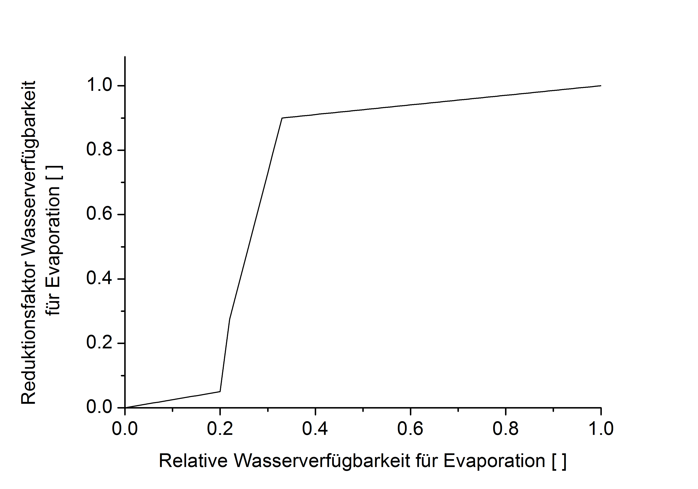

# Evaporation

Die Referenz-Evapotranspiration für eine kurz geschnittene Grasfläche $`\small ET_0`$ wird mit Hilfe der Penman-Monteith-Methode berechnet (1998).

$`\small ET_0 = \frac{0.408 \cdot \Delta \cdot (R_n - G) + \gamma \cdot \frac{900}{\gamma + 273} \cdot u_2 \cdot (e_s - e_a) } {\Delta + \gamma \cdot (1+\frac{r_a}{r_s})} `$

$`\small  \Delta`$	Gradient der Dampfdruckkurve	$`\small  [kPa\,K^{-1}]`$ 
$`\small  R_n`$	Nettostrahlung an der Bestandesoberfläche	$`\small  [MJ\, m^{-2} \, d^{-1}]`$ 
$`\small  G`$	Bodenwärmeflussdichte	$`\small  [MJ\, m^{-2} \, d^{-1}]`$ 
$`\small  T`$	Tagesmitteltemperatur der Luft in 2 m Höhe	$`\small  [^{\circ} C]`$ 
$`\small  u_2`$	Windgeschwindigkeit in 2 m Höhe	$`\small  [m \, s^{-1}]`$ 
$`\small  e_s`$	Sättigungsdampfdruck	$`\small  [kPa]`$ 
$`\small  e_a`$	aktueller Dampfdruck	$`\small  [kPa]`$ 
$`\small  \gamma`$	Psychrometerkonstante	$`\small  [kPa \, K^{-1}]`$ 
$`\small  r_a`$	Atmosphärischer Widerstand	$`\small  [s\, m^{-1}]`$ 
$`\small  r_s`$	Oberflächenwiderstand	$`\small  [s\, m^{-1}]`$ 

Die fruchtartspezifische potentielle Evapotranspiration wird berechnet mit Hilfe von ebenso fruchtartspezifischen Faktoren (Kc) während der Wachstumsperiode und Faktoren für den unbedeckten Boden in der Zeit zwischen Ernte und Auflaufen der neuen Frucht. Die Kc-Faktoren sind an die Entwicklungsstadien der Fruchtart gekoppelt.

$`\small ET_p = ET_0 \cdot k_c - I`$

$`\small ET_p`$	Potentielle Evapotranspiration	$`\small [mm] `$ 
$`\small ET_0`$	Referenz-Evapotranspiration	$`\small [mm] `$ 
$`\small k_c`$	fruchtartenspezifischer Faktor	  
$`\small I`$	Evaporation aus dem Interzeptionsspeicher	$`\small [mm] `$ 

Der Anteil der Evaporation an der gesamten Evapotranspiration wird über den Grad der Bodenbedeckung abgeleitet.

$`\small E_p = ET_p \cdot (1-\beta) `$

$`\small E_p`$	Potentielle Evaporation	$`\small [mm]`$ 
$`\small ET_p`$	Potentielle Evapotranspiration	$`\small [mm]`$ 
$`\small \beta `$	Bodenbedeckungsgrad	  

Die Evaporation wird durch die Verfügbarkeit von Wasser im Boden für die Verdunstung und durch den Dampfdruckgradienten in der Bodenluft begrenzt. Der Reduktionsfaktor $`\small \varepsilon_1(z)`$ beschreibt die Limitierung der Evaporation durch mangelnde Wasserverfügbarkeit und wird mit einer empirischen Funktion aus dem HERMES-Modell beschrieben (Abbildung 1). Dafür wird die relative Wasserverfügbarkeit berechnet:

$`\small W_{ERel}(z) =  \begin{cases} 0 & \theta<0.33 \cdot \theta_{PWP}  \\   \frac{\theta - (0.33 \cdot \theta_{PWP})} {\theta_{FC} - (0.33 \cdot \theta_{PWP})} & \theta \geq 0.33 \cdot \theta_{PWP} \end{cases} `$

$`\small W_{ERel}(z)`$	Relative Wasserverfügbarkeit zur Evaporation in Schicht z	  
$`\small \theta `$	Wassergehalt in Schicht z	$`\small [m^3 \, m^{-3}]`$ 
$`\small \theta{PWP}`$	Wassergehalt am Permanenten Welkepunkt in Schicht z	$`\small [m^3 \, m^{-3}]`$ 
$`\small \theta{FC}`$	Wassergehalt bei Feldkapazität in Schicht z	$`\small [m^3 \, m^{-3}]`$ 

Der Reduktionsfaktor Wasserverfügbarkeit für die Evaporation 1(z) in Abhängigkeit von der relativen Wasserverfügbarkeit für die Evaporation {Kersebaum 1989}

Abbildung 1: Der Reduktionsfaktor Wasserverfügbarkeit für die Evaporation $`\varepsilon_2(z)`$ in Abhängigkeit von der relativen Wasserverfügbarkeit für die Evaporation {Kersebaum 1989}

Die Limitierung der Evaporation durch den Dampfdruckgradienten der Bodenluft wird mit Hilfe zweier weiterer Faktoren beschrieben. Der erste von ihnen, Deprivationsfaktor $`\varepsilon_2(z) `$ genannt, berücksichtigt die Tiefe der jeweiligen Bodenschicht und damit, wenn auch nur implizit, die Steigung des Dampfdruckgradienten im luftgefüllten Bodenvolumen.

$`\small \varepsilon_2(z) = (a_1 - a_2) \cdot \frac{\zeta + 1} {log(\zeta + 1) - \zeta}`$

$`\small \varepsilon_2(z)`$	Reduktionsfaktor Ausnutzungstiefe	  
$`\small \zeta`$	Krümmung der Deprivationsfunktion	  

mit

$`\small a_1 = log \left( \frac { \frac{Z_{E \,max}}{\Delta Z} + \zeta \cdot Z}  {\frac{Z_{E \,max}}{\Delta Z} + \zeta \cdot (z-1) }\right) `$

$`\small \zeta`$	Krümmung der Deprivationsfunktion	  
$`\small Z_{E \, max}`$	Maximale Einflusstiefe der Evaporation	$`\small [m] `$ 
$`\small z`$	Nummer der Bodenschicht	  
$`\small \Delta z`$	Schichtmächtigkeit	$`\small [m] `$ 

und

$`\small a_2 = \frac{\zeta} {\frac{Z_{E \, max}}{\Delta z} \cdot (\zeta + 1)} `$

$`\small \zeta`$	Krümmung der Deprivationsfunktion	  
$`\small Z_{E \, max}`$	Maximale Einflusstiefe der Evaporation	$`\small [m] `$ 
$`\small \Delta z`$	Schichtmächtigkeit	$`\small [m] `$ 

Der zweite Faktor beschreibt in einer stark vereinfachten Weise den Umstand, dass kaum Wasser aus seiner Bodenschicht verdunstet, wenn die darüber liegende Schicht mehr Wasser enthält als sie selbst, da sich ein abwärts gerichteter Dampfdruckgradient einstellt.

$`\small \varepsilon_3(z)=\begin{cases}0.1 & \theta_z \leq \theta_{z-1} \\1.0 & \theta_z > \theta_{z-1}\end{cases}`$

$`\small \varepsilon_3(z) `$	Reduktionsfaktor Dampfdruckgradient in Schicht z 	 
$`\small \theta`$	Wassergehalt in Schicht z	$`\small[m^3 \, m^{-3}] `$ 
$`\small \theta_{z-1}`$	Wassergehalt in Schicht z-1	$`\small[m^3 \, m^{-3}] `$ 

Die oben beschriebenen Reduktionsfaktoren verschmelzen zu einem Reduktionsfaktor für die Evaporation

$`\small \varepsilon_z = \varepsilon_1(z) \cdot \varepsilon_2(z) \cdot \varepsilon_3(z)`$

$`\small \varepsilon_z `$	Reduktionsfaktor für Evaporation in Schicht z	  
$`\small \varepsilon_1(z)`$	Reduktionsfaktor für Wasserverfügbarkeit in Schicht z	  
$`\small \varepsilon_2(z)`$	Reduktionsfaktor Ausnutzungstiefe	  
$`\small \varepsilon_3(z)`$	Reduktionsfaktor Dampfdruckgradient in Schicht z	  

Wenn Wasser sich an der Bodenoberfläche staut, wird die Evaporation nur aus diesem Oberflächenspeicher gespeist. Dabei wird angenommen, dass von der freien Wasseroberfläche 10% mehr Wasser verdunstet als von der Oberfläche eines  feuchten Bodens. Im Falle einer Schneedecke wird die Evaporation auf null gesetzt. Die Sublimation von Schneekristallen wird nicht explizit modelliert. Im Schneemodul wird dieser Prozess jedoch bei der Alterung der Schneedecke mit impliziert.

Die gesamte aktuelle Evaporation ergibt sich aus der Summe der beeinflussten Bodenschichten.

$`\small E_a = \sum_{z=1}^{z_{max}} E_p \cdot \varepsilon_z `$

$`\small E_a`$	Aktuelle Evaporation	$`\small [mm]`$ 
$`\small E_p`$	Potenzielle Evaporation	$`\small [mm]`$ 
$`\small \varepsilon_z`$	Reduktionsfaktor für Evaporation in Schicht z	  
$`\small z`$	Nummer der Bodenschicht	  
$`\small z_{Emax}`$	Unterste von Evaporation beeinflusste Bodenschicht	  
 